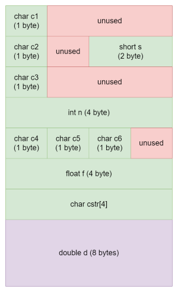
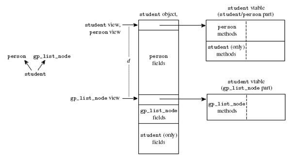

# **Inheritance, Polymorphism and the Object Memory Model**

In this lecture, we describe how objects are stored in memory at runtime. The way objects are stored in memory is enforced partially by the compiler, in the way operations such as access to a member of an object are compiled, and partially at runtime, in the implementation of operations such as new and delete. We will take C++ as an example for the discussion; most of the principles remain unchanged for similar object-oriented languages such as Java.

In C++, an object is implemented at runtime as a region of storage (a contiguous block of memory) with associated semantics. The term object refers to an instance of a class. A class defines the characteristics of its instances in terms of members: data members (state) and member functions (methods). The class defines the memory layout of all the objects that belong to that class. Each object of the class that is created is allocated a copy of all the class data members, except for those declared as static. In contrast to the data members which is distinct for each object of a class, all objects of a particular class share the member functions (methods) for that class. That is, the code for the function is stored only once in memory for each class.

## **How Objects are Stored in Memory**

We distinguish between object values and object references. The simplest way to implement object references is as a pointer to an object value. Object values are implemented as a contiguous block of memory, where each field (data member) is stored in sequence. For example, the memory layout of the object defined as:
```
class A {
  int a;
  float f;
  char c1;
  char c2;
  char d[4]; // An array of 4 char values
};
```

will appear in memory as follows:


Each primitive type is encoded in a fixed amount of memory. For example, an int value is generally encoded in 4 bytes, a char in 1 byte, a double in 8 bytes etc. The sizeof operator of the compiler can be used to find out what is the size used by a given type. sizeof is computed at compile-time (it is not a function, it is a compiler operator). sizeof can also return the size allocated for object data-types. For example, sizeof(A) will return 20 (5 words of 4 bytes).

### **Field Alignment**

Note that the fields c1 and c2 are "word aligned" within the block of memory of the object: all the fields start on a word boundary (each word is 4 bytes long). This means that some memory may be left "wasted" in the block of memory (as marked by the "unused" regions). (Sometimes we may be interested in avoiding this waste and may request the compiler not to align fields - but this is extremely rare.)

The reason for aligning fields within the memory is that it makes accessing the data fields much easier. Each field is known to the compiler by its datatype (which determines its size in memory) and its offset within the object.
```
a: offset 0
f: offset 4
c1: offset 8
c2: offset 12
d: offset 16
```
When the compiler translates a reference to a field, it uses the offset of the field within the object to access the specific field. For example, in the following code:
```
{
  A a1;
  cout << a1.c2;
}
```
the reference to a1.c2 is translated to:
```
  -- push activation frame for new block with one variable of 20 bytes (for a1)
  -- invoke constructor of A on the address of register S (top of stack)
  READ [S]+12, B  -- Read the address [S]+12 into register B
```

### **Memory Layout of Arrays**

While each field is aligned on a word boundary, arrays are generally "packed": the elements of the array are represented one after the other, consecutively, with no holes, as is shown for the array d of 4 char values.

### **Memory Layout and Inheritance**

When a class C extends a class P, all the fields defined in P exist in C and in addition, new fields are defined for objects of type C. In terms of memory, it means the block of memory associated to objects of class C is larger than that of objects of class P.

For example, class B extends class A and adds a new field in its state:

```
class B : public A {
public:
  double g;
};
```
The memory layout of objects of class B looks as follows:



Note that the first 20 bytes of this block have exactly the same structure as a block of type A. This makes it easy to "look at a B value" as if it were an "A value": we just take the first part of B and "cut it short" to sizeof(A).

### **Polymorphism Implementation: vtable**

As mentioned above, the code for the methods of a class is stored only once for each class. Our picture of the memory allocated to a process now covers 3 distinct areas:
* The heap: stores values allocated using the new operator
* The stack (in fact, there is one stack for each active thread): stores automatic values in activation frames
* The code segment: stores the code of all the classes used in the program executed by the process

An object is characterized by the following elements:
* Its identity
* Its state
* The set of objects it knows
* Its interface (the set of messages to which the object can react)

As a first approximation, we can use the address of the object data in memory as its identity (we will see below that this is not always exactly true when we discuss casting and inheritance). The state of the object is encoded in the memory block associated to the object (which encodes the value of each of its fields). The interface of the object is known by the compiler, based on the type of the object: each class defines the set of methods to which the objects that belong to the class can react.

For example, the following class has as an interface for the methods C::C() (constructor), C::f() and C::g(), and also for default functions like C::~C() (destructor), copy constructor, and assignment operator:
```
class C {
  private:
    int i;
    char c;
  public:
    C() { i = 0; c='a'; }
    int f(int j) const { return i+j; }
    char g() const { return c; }
};
```

The code for these functions is stored in the code region of the memory allocated to the process in which the class is used. Each function is encoded as a sequence of processor instructions. Each function is known to the compiler by its start address in memory. The invocation of a method is encoded by the compiler as a sequence of instructions: parameters are pushed on the stack, then the function is invoked by using the CALL instruction of the processor, which is passed as a unique argument the address of the first instruction of the function that is invoked.

For example:

```
{
  C c1;
  int x = c1.f(2);
}
```
is compiled into code that performs these operations:
```
  -- push new activation frame for block on stack with one value for c1 of size 8 bytes (2 words) and one value of size 4 (x)
  -- invoke C::C() on the address [S] (top of the stack)
  push [S]     -- push the address of c1 on the stack (hidden parameter this)
  call [C::C]  -- invoke the function at address C::C
  push $2      -- push the constant 2 on the stack
  push [S]     -- push the address of c1 on the stack (hidden parameter this)
  call [C::f]  -- invoke c1.f(2)
  write ReturnRegister, [S-4]  -- copy the value returned by f into variable x which is below c1 in the stack
  push [S]     -- push the address of c1 on the stack (hidden parameter this)
  call [C::~C] -- invoke the destructor of c1
```

At this point, we assume that when the compiler generates code for a class, it maintains an internal table where it keeps track of the address of each of the methods of the class (in our case C::C, C::f and C::g). We will now see that the compiler makes this table visible at runtime to allow late binding.

### **The implicit "this" parameter**

When the compiler invokes a method of a class, we always assume the method has access to the internal state of the object, wherever it may be. How does the method know where to find the fields of the object to read their value or update it? For example, when the constructor of a class is invoked, we must be able to set the value of the fields.

The solution is that when a method of an object is invoked, the compiler always passes a "hidden" parameter to the call: the address of the object, which is always encoded in the ```this``` pointer. In C++, the this pointer is always of type ```C*``` for a class of type ```C``` - that is, this contains the address of a block of value organized according to the structure of class C.

Note that static methods do not have access to the this parameter - they do not have this implicit parameter and therefore, they can be invoked independently of any specific object value: while a call to ```C::f(2)``` without a ```C``` value is illegal, a call to a static method ```C::static_method(x)``` would be possible.

### **Late Binding**

*Late binding* is an essential property of object-oriented polymorphism: it refers to the possibility to decide which method to invoke at runtime and not at compile time. Consider this example:

```
// Abstract class shape
class Shape {
public:
  virtual draw()=0;
};
 
class Circle : public Shape {
public:
  Circle() {...}
  virtual draw() {....}
};
 
class Rectangle : public Shape {
public:
  Rectangle() {...}
  virtual draw() {....}
};
 
void main(...) {
  Circle c1;
  Rectangle r1;
  Shape* s;
 
  s = &c1;
  s->draw();  // s now refers to a value of type circle (c1).  s will invoke the method Circle::draw
  s = &r1;
  s->draw();  // s now refers to a value of type rectangle (r1).  s will invoke the method Rectangle::draw
}
```

The key point is that the compiler does not know the address of the function to invoke when it sees the code ```s->draw()```. The same C++ instructions will sometimes end up executing ```call [Circle::draw]``` and sometimes ```call [Rectangle::draw]```. How does the compiler manage to produce the right code?

#### **Vtable Mechanism**

The way the compiler decides which method to invoke at runtime is by delaying the decision of which method to invoke to runtime, instead of deciding at compile time. Observe that when a method is marked as virtual, the actual method that is invoked at runtime depends on the type of the value of the object at runtime, and not on the type of the value at compile time.

For example, in the code above, while s is a variable of type Shape, when we invoke ```s->draw()```, we end up calling the method ```draw()``` of ```Rectangle``` or ```Circle``` depending on the value to which ```s``` is bound at the time of the method invocation.

What we are describing is the way an object decides which code to invoke when it receives a message. The message is the invocation of a method through an object reference (in C++, through a pointer to an object). The way it is implemented by the compiler is that the value of the object in memory is extended by a pointer to the table in which the address of each function for the class of the object are stored. This table is now stored explicitly in the process memory (in the code region). There is one such table for each class that contains virtual methods. The table of each class contains the address of each method of this class. This table is called the virtual-table (in short, vtable) of the class.

Consider the class foo in the following diagram:


The vtable for class ```foo``` contains the address of each of the methods of class ```foo``` (```k,l,m,n```). The block of memory of a value of type foo starts with a pointer to the vtable of class ```foo``` - followed by the state of the object.

#### **Invoking a virtual method**

Suppose d is of type ```foo *```. A call to an object reference such as ```d->m()``` is handled by dereferencing ```d```'s vpointer, looking up the m entry in the vtable, and then dereferencing that pointer to call the correct method code.

In the case of single inheritance, if the vpointer is always the first element in ```d``` (as it is with many compilers), this reduces to the following simple call (using the ```*``` notation as in C++):

```
*((*d)[2])(d);
```

To understand this, note that:

* ```d``` is the address of the beginning of the block of memory which stores the ```foo``` value bound to ```d```
* ```*d``` is the content of the first word in the block of memory: it contains the address of the vtable
* ```(*d)[2]``` is the address of the 3rd element in the vtable (the address of method m)
* ```*((*d)[2])(d)``` means that we invoke the function located at the third slot in the vtable of foo and pass to it the address of the value (the this implicit parameter).

#### **Inheritance and vtable**

When a class extends another class, how is the vtable managed? Consider the following example: class ```bar``` extends class ```foo```. ```bar``` overrides the method ```m```, and introduces 2 new methods ```s``` and ```t```.


The compiler generates a new distinct vtable for class bar. The vtable elements point to the same addresses as those of the parent class when the method is not overridden (methods ```k```, ```l``` and ```n``` in the example), but to the new overridden method or to the new methods otherwise (methods ```m````, ```s``` and ```t``` in the example).

Note that the vtable of the inherited class is an extension of the vtable of the parent table: the methods that are shared between foo and bar appear in the same order in the vtables of foo and bar, and the new methods that appear only in the child class appear at the end of the vtable. This allows us to still consider a child value as an "extended parent value": it is always safe to use a child value in place of a parent value and execute exactly the same code to reach the right function.

#### **Vtable and Multiple Inheritance**

C++ supports multiple inheritance: a class can extend more than one base class. Consider the following example:



Class ```student``` inherits both from class ```person``` and from class ```gp_list_node``` (a class used to store the grades of the student). The vtable layout becomes more complex in such a situation. An object of type student has in its state 3 types of fields:
* Fields that are inherited from person
* Fields that are inherited from gp_list_node
* Fields that are declared only in class student

Similarly, there are 3 types of methods that a student object can invoke:
* Methods inherited from person
* Methods inherited from gp_list_node
* Methods defined only in class student

Consider the block of memory associated to a student value. The first part is exactly as above – the vpointer points to a student specific vtable that first contains all the ```perso```n methods, then all the methods that only appear in class ```student``` (but not in class ```gp_list_node```). The memory block is then followed by the ```person``` fields. This follows from the requirement that it should be possible to look at a ```student``` value as a ```person``` value: just ignore the bottom part of the block and we must obtain a valid person value. This explains why we cannot store the ```gp_list_node``` vpointer at the beginning of the block.

So where can we store the ```gp_list_node``` vpointer? Well, we store it right after the person fields. And for the same reason, we store the ```gp_list_node``` data members after this vpointer field.

Finally we store the ```student``` specific data members at the end of the data block.

A problem now arises: if we invoke a method inherited from ```gp_list_node``` on a ```student``` value, how does the compiler find the appropriate vtable (or its vpointer)? In addition, how can we pass a valid this pointer to a method of ```gp_list_node``` that is not overridden when we invoke it on a student value? Realize that the code of such a method cannot know that what it receives as a this pointer is not a real ```gp_list_node``` value. It accesses the fields of the value it has assuming it is a ```gp_list_node``` value.

The solution is called "pointer fixup": the compiler knows what type of method is invoked - either inherited from ```person```, from ```gp_list_node``` or specific to ```student```. If it is inherited from ```gp_list_node```, it does not pass the real this address to the method, but the "corrected address" (in the diagram ```this+d``` - where ```d``` equals ```sizeof(person)```). Note that when we look down from this address, the block of memory looks again as a valid ```gp_list_node``` value with an extension. The first word contains a vpointer which points to a valid ```gp_list_node``` vtable (it contains the methods known to ```gp_list_node``` in the correct order).

There are many more complex issues involved in dealing with multiple inheritance, in particular cases related to replicated fields and what is called virtual inheritance in C++. It is mainly to avoid such complexity that Java decided not to support multiple inheritance, and instead restrict the possibility to implementing multiple interfaces.

### **Casting and Addresses**

A consequence of the pointer fixup mechanism described above to keep in mind is that when we cast an object to a different class, we may end up with a different address in memory.

```
class P1 {
public:
  virtual m();
};
class P2 {
public:
  virtual n();
};
class C : public P1, public P2 {
};
int main() {
  C* c = new C();
  P1* p1;
  P2* p2;
  p1 = dynamic_cast<P1*>(c); 
  p2 = dynamic_cast<P2*>(c);
  // p1 and p2 have different values
}
```

That is, casting is not only a way to tell the compiler "trust me I know what I do" to overcome the type system; it also can end up generating code to fix the pointers in memory.

#### **g++ fdump-class-hierarchy option**

It is instructive to look at the exact structure of the vtables the compiler generates for us. g++ has an option that allows us to get this information in a readable manner:
The following command:

```g++ c.cpp -fdump-class-hierarchy -o c```
will generate a text file called c.cpp.t01.class which gives the details of the memory layout and vtable of the classes defined in the file.

### **Virtual methods: performance issues**

As shown above, invoking a virtual method is more expensive at runtime than invoking a regular function. The reason is that we must perform 2 operations: get the location of the function's code from the vtable of the object, and then invoke the function.
There are 2 other costs to the vtable mechanism:
* Object values are extended by one word for each vtable to which they refer.
* Virtual methods cannot be compiled "inline" (inlining is a compiler optimization method which avoids the cost of calling a function - pushing arguments on the stack, popping them out at the end - by copying the code of the function at the point of its invocation). Inlining is mostly useful for small functions that are invoked often.

These 3 costs combined can have a strong effect on the performance of a program. This is the reason why in C++, methods are not virtual by default. If a class does not have any virtual method, then values of this type do not include a vtable.

In contrast, in Java, methods are always virtual.

### **Implementing Interfaces in C++**

As explained above, Java avoids the complexity of multiple inheritance, and instead restricts programmers to use only single inheritance and the mechanism of interfaces.

Interfaces are, in fact, a restricted method of multiple inheritance. To understand the relation, consider how one defines interfaces in C++: an interface is a pure virtual abstract class. A pure virtual abstract class is a class which fulfills the following criteria:
* It does not define any data members.
* All of its methods are virtual.
* All of its methods are abstract (or "pure virtual" marked in C++ as ```virtual m() = 0;```)

For example:
```
// A C++ interface
class serializable {
public:
  virtual void serialize(stream& s) = 0;
};
 
// A class implementing the serializable interface
class C : public virtual serializable {
public:
  C() { ... }
  virtual void serializable(stream& s) { ... }
};
```

Note that to express that we "implement an interface" - we use the method called "virtual inheritance" in C++. (See http://en.wikipedia.org/wiki/Virtual_inheritance for an explanation of the difference between regular and virtual inheritance).

### **The Visitor Pattern**

We have explained above that polymorphism is a way to dispatch a message to the appropriate function at runtime. Another way to look at the issue of polymorphism, as a programmer, is the reverse statement: whenever you face a situation where you want to decide at runtime which piece of logic to execute, you should think about polymorphism.

For example, whenever you find yourself in a situation where you type code such as:

```
// This calls for polymorphism!
if (getType() == type1) {
  // process type1 case
} else if (getType() == type2) {
  // process type2 case
} ...
```

When you see such cases in your code, it is time to refactor it, and to introduce polymorphism. The [Visitor pattern](http://en.wikipedia.org/wiki/Visitor_pattern) is a way to achieve such re-organization of your code. Consider the following simple example: a Printer object can print Document objects. The code to print different types of documents is different. The code for each type of printers is also different. This is a single case of a situation called [double dispatch](http://en.wikipedia.org/wiki/Double_dispatch). A bad way of solving this situation is shown in the method badPrint in the code below. A more extensible way (with less coupling) is shown in the rest of the code. The basic idea is to use the virtual table dispatch mechanism to send the print message to the right method. When a printer object receives the print message with a document object, the first dispatch happens when we select the appropriate printer object. The second dispatch (based on the type of document) is achieved by sending the printMe message to the document. Now, we do not want each document class to know about each printer class – that would be very bad coupling. So instead, the document object just invokes the specific printer method on a specific document type method. Eventually, each document type for each printer type has a separate method handling the specific code.

Such usage of polymorphism is detected while coding each time a structure such as case of if-else-if appears repeatedly.

```
#include <iostream>
 
//forward declarations 
class Printer;
class PDFDoc;
class DocDoc;
 
class Document{
public:
    //this is the accept function
    virtual void printMe(Printer *p)=0;
};
 
class Printer{
public:
    virtual void print(Document *d)=0;
 
    //the visitors
    virtual void print(PDFDoc *d)=0;
    virtual void print(DocDoc *d)=0;
};
 
class PDFDoc : public virtual Document{
public:
    virtual void printMe(Printer *p){
        std::cout << "PDFDoc accepting a print call" << std::endl;
        p->print(this);
    }
};
 
class DocDoc : public virtual Document{
public:
    virtual void printMe(Printer *p){
        std::cout << "DocDoc accepting a print call" << std::endl;
        p->print(this);
    }
};
 
 
class MyPrinter : public virtual Printer{
public:
    void badPrint(Document *d){
        if (dynamic_cast<PDFDoc*>(d)){
            print(dynamic_cast<PDFDoc*>(d));
        } else if (dynamic_cast<DocDoc*>(d)){
            print(dynamic_cast<DocDoc*>(d));
        } else {
            std::cout << "what to do???" << std::endl;
        }
    }
 
    virtual void print(Document *d){
        std::cout << "dispatching function <print> called" << std::endl;
        d->printMe(this);
    }
    virtual void print(PDFDoc *d){
        std::cout << "printing a PDF doc" << std::endl;
    }
    virtual void print(DocDoc *d){
        std::cout << "printing a Doc doc" << std::endl;
    }
};
 
int main(){
    MyPrinter p;
    Document *docA = new PDFDoc();
    Document *docB = new DocDoc();
 
    p.print(docA);
    p.print(docB);
    std::cout << "using badPrint" << std::endl;
    p.badPrint(docA);
    p.badPrint(docB);
    delete docA;
    delete docB;
    return 0;
}
```
