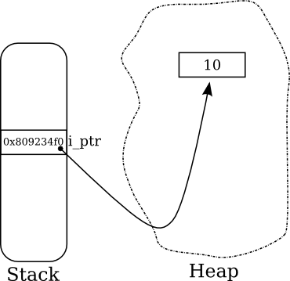
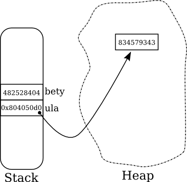

# **Pointers and References**

## **Introduction**

In Java, life was easier. There were only primitive types and Objects. Primitives were always allocated on the stack, and Objects on the heap. However, as we have seen in the previous lecture, things are not so simple in C++: both primitives and objects may be allocated on the stack or on the heap. Anything allocated on the heap can be reached by holding an **address** to its location on the heap. The type of a variable that holds an address to a memory location is called a *pointer*.

The main memory can be thought of as if it was a huge array of bytes, a pointer is actually only an index in this array - this means that a pointer is no more than a glorified int. Since there are types (like ```int, long, double```, etc.) that requires more than one byte - the pointer will hold the address to the first byte in the sequence of bytes holding the referenced value. For example the int value 7 on a memory of a 32 bit system will be composed of the following bytes (in little endian) ```07 00 00 00``` this value may be reside on the memory starting in the address 51084, therefore: ```int *p=51084;``` defines a pointer to int (i.e., to a 4 sequential bytes) starting at 51084. The value inside this address is 7 while the address itself is ```51084```.

Pointers are primitive types in themselves. They hold the memory address of a primitive or an object which resides either on the heap or on the stack. A pointer to a type type_a is of type ```type_a *```, where ```type_a *``` is a primitive type, regardless of the type ```type_a```. Since ```type_a *``` is a type, and we said we can have a pointer to any type, we can have a pointer to a pointer to ```type_a```, whose type is ```type_a **```. And we can have a pointer to a pointer to a pointer to ```type_a``` ….

### **Some Examples**

Consider the following code:
```c++
#include <iostream>
 
int main()
{
   int *i_ptr = new int(10);
   
   std::cout << *i_ptr << std::endl;
   return 0;
}
```
When we execute the code, the following takes place:

1. Space for a primitive of type ```int *``` is allocated on the activation frame of the main function.
2. The space allocated is associated with the variable ```i_ptr```.
3. Space for a primitive of type int is allocated on the heap (using the new operator), and is initialized to 10.
4. The address of the newly allocated integer is saved in ```i_ptr```.
5. The operator ```<<``` of ```std::cout``` is passed the content (by value) ```i_ptr``` points to. That is, ```std::cout```'s operator ```<<``` is called with the integer 10.

The memory of the process will look something like this:


We have also introduced a new operator in C++, operator ```*```, whose value is the content of the memory to which the pointer points.

Let's try something a bit more complicated:
```c++
class Cow {
private:
        int _id;
public:
        Cow(int id): _id(id) { //member initialization list
        }
 
        int getId() const {
                return this->_id;
        }
 
        void setId(int newId) {
                this->_id = newId;
        }
 
        void moooo() const {
                std::cout << "moooo: " << this->_id << std::endl;
        }
}
```

Several points need to be clarified before we continue:

The constructor of the class initialize the class fields using a *member initialization list*. In C++, we use a member initialization list to initialize class members. The initial value can be any expression. The member initialization list is executed before the body of the function. It is possible to initialize data members inside the constructor body but not advised for the following two reasons:

* **Implicit call to default constructor** - when a data member is itself a class object, not initializing it via the initialization list means **implicitly calling its default constructor!** If you do initialize it in the body of the constructor you are actually initializing it twice. If your data member is a class with no default constructor, meaning you supplied some constructor that has parameters, you will not be able to pass compilation - think why.
* **Const members** - Const members of a class can only be initialized via member initialization list.

The order the initialization happens is according to the order the member vars are declared (not the order in the member initialization list). It is hence a convention to keep the order of the list as the order of the declaration.

In addition, to the usage of member initialization list you should also note that:

* Whenever member methods of a class ```T``` are executed, this is always of type ```T *```, and points to the location, in memory, in which the instance we are working on resides.
* When a method of an object does not change the object's internal state, we define the method as ```const```. It is good practice to mark each "logical" const method as ```const```.
* We have also introduced a new operator in C++, operator ```->```, which is used to access the members and methods of objects via a pointer to the object. Accessing members / methods of an object not through a pointer is done using the ```.``` (dot) operator, as in Java.

So, we have our ```Cow``` class, let us instantiate some cows (and have some milk?):
```c++
int main()
{
        Cow bety(482528404);
        Cow *ula = new Cow(834579343);
 
        bety.moooo();
        ula->moooo();
        return 0;
}
```
Leaving the actual work done by the constructor of the cow to the next lecture, let's consider what is happening here:

1. Space for a Cow is allocated on the activation frame of the main function, and the constructor of Cow is called with 482528404, while this points to the address of the space allocated on the stack.
2. The space allocated is associated with the variable bety.
3. Space for a pointer Cow * is allocated on the activation frame of the main function.
4. The space allocated is associated with the variable ula.
5. Space for a Cow is allocated on the heap (using the new operator), and its constructor is called with 834579343, while this points to the address of the space allocated on the heap.
6. The address of the newly allocated Cow is saved in ula.

After drinking some coffee (with cream, of course), we can draw the following memory picture:


### **Dereferencing a Pointer and the "Address Of" operator**

We have already seen how to dereference a pointer, using the ```*``` operator. For example, the following code is valid:
```c++
(*ula).moooo();
```
It is valid, since ```(*ula)``` is of type Cow, and can be accessed using the ```.``` (dot) operator.

Now, we sometimes would like to take the address of something and store it for later use. To this end there is another operator, the "address of" operator, ```&```. For example,

```c++
int i = 10;
int *i_ptr = &i;
```

```i_ptr``` holds the address in which ```i``` is stored on the stack. We can use this to pass pointer arguments to functions:

```c++
void inc(int *i_ptr)
{
   (*i_ptr)++;
}
 
...
...
...
 
int i = 0;
inc(&i);
std::cout << i << endl;
```

and the output will be 1.

### **The 'Reference' Concept**

C++ supports the concept of References. There are two types of references in C++: *lvalue* references and *rvalue* references, before learning about references we should first understand what lvalues and rvalues are.

### **lvalues and rvalues**

[^const-pointers]: Any type in C++ can be marked as ```const```, which means that its value cannot be changed (or even reassigned). A const pointer is declared by adding the ```const``` keyword after the type, for example, ```int *const i_ptr``` is a const pointer to an ```int```

Every C++ expression is either an lvalue or an rvalue. An lvalue refers to an object that persists beyond a single expression. You can think of an lvalue as an object that has a name. All variables, including nonmodifiable (const[^const-pointers]) variables, are lvalues. An rvalue is a temporary value that does not persist beyond the expression that uses it. To better understand the difference between lvalues and rvalues, consider the following example:

```c++
int main()
{
   int x = 3 + 4;
   print(x);
}
```

In this example, ```x``` is an lvalue because it persists beyond the expression that defines it. The expression ```3 + 4``` is an rvalue because it evaluates to a temporary value that does not persist beyond the expression that defines it. Another way to think about it is: lvalues are values that can appear in the left side of an assignment while rvalue are the rest. In the first line of the previous example ```x``` is an lvalue and ```3+4``` is an rvalue since you can write ```x = 3+4```vbut not ```3+4=x```.

#### **Regular references (lvalue references)**

In this lecture we will learn about lvalue-references, rvalue references will be learnt on the next lecture.
An lvalue reference (or just a reference) can be seen like a const pointer to an lvalue (without using any pointer notations). A reference may only be assigned once, when it is declared (which is called the initialization of the reference), and may not be altered to reference something else later. Due to this behavior references are commonly defined as 'aliases for variables'. For example, consider the following code:

```c++
int i=0;
int &i_ref = i;
 
i_ref++;
std::cout<<i<<std::endl;
```
The output, not surprisingly, is ```1```.

We can have a reference to any type by adding the ```&``` keyword after the type. However, we cannot have references to references (this is explicitly illegal).

#### **Const lvalue References**

Since lvalue references can only accept lvalues, the following holds:

```c++
int foo() { return 42; }
 
...
int x = 10;
int& i = 4; //illegal - 4 is not an lvalue
int& j = x + 1; //illegal - again - not an lvalue
int& k = foo(); //not an lvalue too!!
const int& s = foo(); //this works! wait what?
```
Why does the last line valid?? This is a C++ feature… the code is valid and does exactly what it appears to do.

Normally, a temporary object (i.e., an rvalue) lasts only until the end of the full expression in which it appears. However, C++ deliberately specifies that binding a temporary object to a reference to const on the stack lengthens the lifetime of the temporary to the lifetime of the reference itself, and thus avoids what would otherwise be a common dangling-reference error. In the example above, the temporary returned by ```foo()``` lives until ```s``` get out of scope.

**Important Note**: Const reference is the same as reference to const i.e., one can write const Foo &i OR Foo const &i.

## **Parameter Passing**

Generally speaking, all parameters are either 'in' parameters or 'out' parameters. 'in' parameters can be considered as information passed to the function, which the function does not need to change. Moreover, any operation on an 'in' parameter are not visible outside of the function. 'out' parameters are meant as a side-channel from which the function may return information, in addition to the return value. Any changes made to 'out' parameters are visible outside the scope of the function.

In Java there are only 2 forms of passing parameters to methods, both of them are performed implicitly; primitives are passed by value (as 'in' parameters) and Objects by reference (possible 'out' parameters). In C++ there are 3 (yes, three) forms for parameter passing, all of them **explicit** (meaning that the programmer must explicitly state which method to use). C++ allows each type to be passed using either one of these forms.

The available forms are:

* **By value**, for 'in' parameters.
* **By reference**, for either 'in' or 'out' parameters.
* **By pointer**[^a-simple-observation], for either 'in' or 'out' parameters.

[^a-simple-observation]: Actually, there are only two ways of passing parameters to function; by value and by reference. By pointer is actually by value, where the value being copied is an address.

### **By Value**
Passing arguments to functions by value does not require any special handling by the programmer. For example, consider the following function which takes and ```int``` and a ```Cow```:

```c++
void byVal(int i, Cow mooo){
        mooo.setId(i);
}
```

And the following code:

```c++
Cow hemda(20);
byVal(30, hemda);
std::cout << hemda.getId() << std::endl;
```

which, surprisingly, outputs the value ```20```. When we call **byVal**, both ```30``` and the entire content of ```hemda``` are copied (we will talk more about how objects are copied in the next lecture), and placed on the activation frame of byVal. From then on, byVal performs all of its operations on these local copies only, hence no changes to ```hemda``` is made.

### **By Pointer**

If we want to change the original parameter passed to the function we can use pointers. For example, we may change the code in the following way:

```c++
void byPointer(int i, Cow *mooo){
        mooo->setId(i);
}
```

And the following code:

```c++
Cow hemda(20);
byPointer(30, &hemda);
std::cout << hemda.getId() << std::endl;
```

The output is indeed ```30```, as the function byPointer received a pointer to the location of ```hemda``` on the activation frame of the calling function, and changed its id.

Pointers are also used to pass large sized parameters (Objects) which we do not want to copy when passing them to a function.

### **By Reference (lvalue)**

When we wish to refrain from using pointers, which are inherently unsafe (type-wise, as they can be easily cast to other types), we may use references.

```c++
void byReference(int i, Cow &mooo){
        mooo.setId(i);
}
```

```c++
Cow hemda(20);
byReference(30, hemda);
std::cout << hemda.getId() << std::endl;
```

This code produces the same output as before (```30```), but we did not have to pass pointers, and our code is type-safe. Moreover, the compiler is allowed to optimize the reference beyond the "const pointer" abstraction from above, which may yield better code.

### **When to Use Each Form of Parameter Passing**

**In parameters**
As we have seen passing parameters by value comes with a cost. When we are not willing to pay the cost of copying and constructing a new object we will use a const reference. For example: void foo(Cow const& c_ref).

**Out parameters**
If we want to change a parameter such that it will be visible outside the scope of the local function(out parameter) we will use either by-reference or by-pointer but when is advisable to use each ?


**Recommendations**
For a function that uses passed data without modifying it (In parameter):

* If the data object is small, such as a built-in data type or a small structure, pass it by value.
* If the data object is an array, use a pointer because that's your only choice. Make the pointer a pointer to const.
* If the data object is a good-sized structure, use a const reference.
* If the data object is a class object, use a const reference

For a function that modifies data in the calling function (Out parameter):
* If the data object is a built-in data type, use a pointer or a reference, prefer the later.
* If the data object is an array, use your only choice, a pointer.
* If the data object is a structure, or a class object, use a reference

When receiving a pointer check pointer for nullity. (A reference cannot be null.)

### **Returning Values From Functions**
As in parameter passing, values can be returned either by value (copy), reference or pointer. However, when returning something by reference or pointer care should be taken not to return a reference or a pointer to the soon to be demolished activation frame. Consider the following BAD example:
```c++
Cow& f(int x) {
       Cow c(x);
       return c;  // THIS IS A TRAGIC MISTAKE
                  // c would be undefined as soon as the function returns.
     }
```
**Returning a reference / pointer to an invalid address on the stack is one of the main pitfalls of C++ beginners.**

The worst can happen as in the following example:

```c++
#include <iostream>
int *f()
{
    int i = 1;
    cout << &i << endl;
    return &i;
}
void g()
{
    int k = 2;
     cout << &k << endl;
}
void main() 
{
    int *i = f();
    cout << *i << endl;
    g();
    cout << *i << endl;
}
```
Here is what I got when I tried different level of compiler optimizations:

```g++ 1.cpp; ./a.out```

0xbffff564 134513864 0xbffff564 134513864

```g++ 1.cpp -O1; ./a.out```

0xbffff564 1 0xbffff564 2

```g++ 1.cpp -O2 ; ./a.out```

0xbffff560 1 0xbffff564 134519000

```g++ 1.cpp -O3 ; ./a.out```

0xbffff574 1 0xbffff570 1

**This is totally bad as we can not predict how our program will work! No flag is lifted for us,a.k.a no exception, no segmentation fault. It works every time differently.**

## **C++ Arrays**

[^arrays]:When do we need arrays? Arrays are mainly needed when you have to call some legacy C code, which works with plain old arrays. However, even in these cases, it is possible to convert a Vector to an array before calling the C code.

Let us start with a word of caution: unless you really need to, do not use arrays in C++. They are dangerous. Use Vectors instead. We will see some reasons why later[^arrays].

Arrays in C++ are just blocks of continuous memory, which store data of the same type. For example, the memory image of an array of integers which holds the number ```5``` in each cell looks like this:


Each cell is of size exactly 4 bytes, which corresponds to the size of ```int``` on my computer (as you can guess, int may take more bytes on other architectures). Assuming the array starts at address 0xa0 in memory, the address of each cell is specified next to it.

Accessing individual cells of the array is done by dereferencing a pointer to the specific cell. Assuming we have a pointer to the start of the array, ```int *arr_ptr```, we can access the fourth cell by using ```arr_ptr[3]```, which is a shorthand notation for ```*(arr_ptr+3)```. Another thing to notice is the *pointer arithmetic* taking place; we add 3 to ```arr_ptr```, but we do not mean 3 bytes, but 3 ints. which means that we add 3 times ```sizeof(int)```. This is true for every type of pointer, where when we add/subtract numbers from the pointer they are implicitly multiplied by the size of the data the pointer points at.

### **Arrays on the Heap**

Arrays (like everything in C++) may be allocated on the Stack or on the Heap. Allocating an array on the heap is achieved using the ```new []``` operator, and deallocating an array by the ```delete []``` operator. Consider the following code:
```c++
int *arr = new int[100];
 
std::cout << arr[2] << std::endl;
...
...
delete [] arr;
```
The output of this code will always be ```0```, since the ```new []``` operator guarantees to initialize the array's elements by using their default constructor, which in the case of int initialize them to 0. Now, we have not talked about constructors yet, but remember that if you allocate an array of some type (primitive or object), each cell is initialized by the default constructor.

What exactly happens when we call delete ```[]```? Consider this code, which allocates an array of Cow pointers (hence, its type is ```Cow **```):

```c++
Cow **cow_arr = new Cow*[100];
 
for (int i=0; i<100; i++)
      cow_arr[i] = new Cow(i);
 
...
...
 
delete [] cow_arr;
```

We initialize a new Cow object on the heap, and store a pointer to it in a cell of ```cow_arr```. When we call ```delete []```, we expect that the array will be deallocated, since we said an earlier lecture that ```delete []``` calls the destructor of each element in the array! However, please remember that each element in the array is a pointer, and the destructor of a pointer is a nop - which means that the individual Cows we allocated will not deleted! ```delete []``` deallocates only the memory allocated by ```new []```, which means that we will need to delete each Cow we allocated manually – before deleting the array!

### **Arrays on the Stack**
To allocate an array on the Stack, the array's size must be known in advance. For example, to allocate an array of 5 Cows on the Stack we use the following code:

```c++
Cow cow_arr[5];
```

Similar to the case above, each Cow will be initialized using its default constructor. However, we may also tell the compiler how to initialize individual Cows:

```c++
Cow cow_arr[5] = {Cow(1), Cow(21), Cow(454), Cow(8), Cow(88)};
```

Accessing cells of the array when it is allocated on the Stack is achieved in the same as through a pointer, which suggests that ```cow_arr``` is basically a pointer to the beginning of the array of Cows on the Stack.
