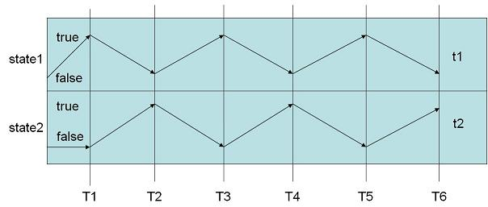
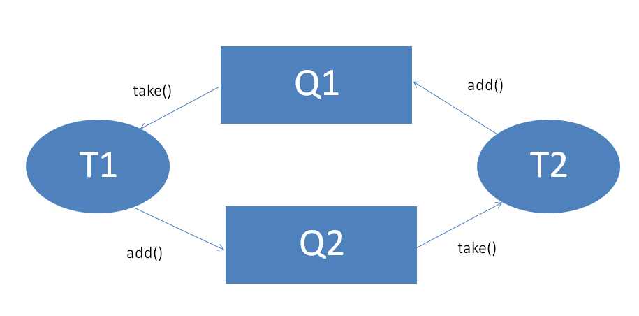

We will start this lecture by first talking about the performance of our programs. We will then delve into the domain of Liveness issues, which have substantial effects on the performance of our code.

## **Performance**

In this lecture, we consider the following aspects of performance:
* Throughput - How much work can your program complete in a given time unit? For example, when writing an HTTP web server, we may be interested in how many pages per second can the server actually serve.
* Latency - How quickly can your program respond to events?
* Efficiency - What is the computational complexity of your program? How efficiently are you using the RTEs resources?

Throughput and Latency are not the same; consider the next example: Spl AirLines, a prominent airline company, operates an air link between Tel-Aviv and New York. Each day, two airplanes make the trip from TA to NY. Each airplane holds 250 passengers. Therefore, the **throughput** of the TA-NY line is 500 passengers per day. However, consider now Mr. Smith, who is interested in taking a flight from his house in TA to his parents in NY. To Mr. Smith, the **latency** of his flight is the time interval since he left his house in TA till he reached his parents' house in NY.
So, we would like our programs to perform well, and then a bit better. In this course we do not presume to talk about all the issues related to performance, but one issue comes to mind in the context of the previous lectures: Liveness. Liveness issues arise mainly due to safety techniques.

## **Liveness**

Liveness is a general property you would normally like to have in your programs. It is about your program actually doing something useful. Liveness can be summarized thus: "Something useful eventually happens within an activity".
When can the progress of our program be stopped? Up to now we have seen several cases:

* Acquiring locks.
* Waiting on Objects.
* Waiting for I/O.
* Waiting for CPU time.
* Failures.
* Resource exhaustion.

Liveness issues can be divided to several categories. We will next consider livelock, deadlock and starvation.

### **LiveLock**

Consider a narrow hallway, in which only one person may pass at a time. One day, Alice started walking down the hallway. Halfway through, Alice suddenly realized that Bob is approaching her from the other side. As Alice is a really nice person, Alice immediately decided to let Bob pass her by moving to her left. However, Bob is a zen-buddhist, and, at the same time, decided to let Alice pass him by moving to his right. But now, since they both moved to the same side of the hallway, they are still in each-other's way! Alice did not want to delay Bob any further, and decided to move to her right. Bob, at the same time, moved to his left. Again, they obstruct each other.

Alice and Bob may still be moving to their left and right, but not one of them managed to pass. This is called a LiveLock: both Alice and Bob are doing something, potentially useful, but there is no global progress!

In the context of computer programs, livelock issues may be caused by two threads canceling each others' actions, in a similar way to Alice and Bob. Livelock in programming usually arise from bad design, and can be solved by re-designing the system with livelock in mind.

Consider the following abstract example:

```
public class LiveLock{
 
        public static boolean state1 = false;
        public static boolean state2 = false;
        public static final Object lock = new Object();
 
        public static void main(String [] a){
 
                Thread t1 = new Thread(new Runnable(){
                        public void run(){
                           synchronized(lock){
                              while (state1 == false){
                                System.out.println("thread 1 waiting...");
                                state1 = true;
                                state2 = false;
                                lock.notifyAll();
                                try { lock.wait(); }
                                catch (Exception ignored) {}
                              }
                              System.out.println("done");
                           }
                        }});
                Thread t2 = new Thread(new Runnable(){
                        public void run(){
                           synchronized(lock){
                              while (state2 == false){
                                System.out.println("thread 2 waiting...");
                                state1 = false;
                                state2 = true;
                                lock.notifyAll();
                                try { lock.wait(); }
                                catch (Exception ignored) {}
                              }
                              System.out.println("done");
                           }
                        }});
                t1.start();
                t2.start();
        }
}
```

The following diagram illustrates how this code proceeds at runtime. Each time, the 2 threads t1 and t2 "undo" the work done by the other one. The wait() and notifyAll() calls force the 2 threads to work one after the other one by one.



### **DeadLock**

We say that a deadlock occurs when several active objects are waiting for each other in a circular way. Consider two lecturers, both teaching in the same class (a strange idea, but bear with me). The first one is called A, and the second B. Now both want to write on the board. However, they cannot both write on the board at the same time. Hence, they need to grab the board first. Moreover, before writing anything, the board must be erased. Alas, there is only one eraser.

A and B are very simple minded, and each works according to his own algorithm: A first tries to grab the board. If he succeeds, he then tries to grab the eraser. B does the same, but in the opposite order. Consider the following code, in which "grab" is translated to locking the appropriate object:

```
public class Lecturer implements Runnable{
 
    protected final Board board_;
    protected final Erasure eraser_;
 
    public Lecturer(Board b, Eraser e)
    {
        board_ = b;
        eraser_ = e;
    }
 
    public void run() { } 
 
    public static void main(String [] args)
    {
        Board b = new Board();
        Eraser e = new Eraser();
 
        Thread A = new Thread(new Lecturer(b, e) {
            public void run(){
                synchronized(this.board_){
                    Thread.currentThread().yield();
                    synchronized(this.eraser_){
                        eraser_.erase(board_);
                        board_.write();
                    }
                }
            }});
        Thread B = new Thread(new Lecturer(b, e) {
            public void run(){
                synchronized(this.eraser_){
                    Thread.currentThread().yield();
                    synchronized(this.board_){
                        eraser_.erase(board_);
                        board_.write();
                    }
                }
            }});
 
        A.start();
        B.start();
    }
}
```

The problem arises when A grabs the board, B grabs the eraser, and now we have a circular wait! Before discussing the standard technique to prevent deadlocks, take a look at the next example:

```
class BadCell {                                    // Do not use
        private long value_;
 
        public BadCell(long v) {
                value_ = v;
        }
        synchronized long getValue() { return value_; }
        synchronized void setValue(long v) { value_ = v; }
 
        synchronized void swap(BadCell other) {
                long t = getValue();
                long v = other.getValue();
                setValue(v);
                other.setValue(t);
        }
 
        public static void main(String [] args){
                final BadCell a = new BadCell(1);
                final BadCell b = new BadCell(2);
 
                Thread t1 = new Thread(new Runnable(){
                        public void run(){
                                a.swap(b);
                        }});
                Thread t2 = new Thread(new Runnable(){
                        public void run(){
                                b.swap(a);
                        }});
                t1.start();
                t2.start();
        }
}
```

Consider the following turn of events:

| Thread 1	| Thread 2|
| :---: | :---: |
| acquire lock for a on entering a.swapValue(b) | acquire lock for b on entering b.swapValue(a)|
| execute t = getValue() successfully (since already held) | execute t = getValue() successfully (since already held)|
| block waiting for lock of b on entering v = other.getValue() | block waiting for lock of a on entering v = other.getValue()|

Both of our threads are now blocked, and we have a circular wait. No thread will ever break out of it. We can deal with the problem by making sure both of the threads try to lock the Cell objects in the same order. This is called resource ordering. If all the locks in our system are grabbed (and released) in the same order, we can avoid deadlocks. Consider the following improved version, in which the Cell objects themselves enforce resource ordering:
```
class Cell {
        private long value_;
 
        synchronized long getValue() { return value_; }
 
        synchronized void setValue(long v) { value_ = v; }
 
        public void swapValue(Cell other) {
                if (other == this)  // alias check
                        return;
                else if (System.identityHashCode(this) < System.identityHashCode(other))
                        this.doSwapValue(other);
                else
                        other.doSwapValue(this);
        }
 
        protected synchronized void doSwapValue(Cell other) {
                // same as original public version:
                long t = getValue();
                long v = other.getValue();
                setValue(v);
                other.setValue(t);
        }
}
```

### **Deadlock caused by wait**

A deadlock can be caused by any type of "lock" used in circular dependency. We have seen above deadlocks caused by "synchronized" monitors (the BadCell example). Consider the following example, where the deadlock is caused by the wait() construct.

```
class WaitLock {
    public static void main(String [] args){
        SimpleQueue<Integer> q1 = new SimpleQueue<Integer>(5);
        SimpleQueue<Integer> q2 = new SimpleQueue<Integer>(5);

        Thread t1 = new Thread(new Runnable(){
            public void run(){
                Integer i1 = q1.take();
                q2.put(i1+1);                
            }});
        Thread t2 = new Thread(new Runnable(){
            public void run(){
                Integer i2 = q2.take();
                q1.put(i2+1);
            }});
        t1.start();
        t2.start();
    }
}
```

The deadlock of this code is illustrated in the following diagram.



### **The Dining Philosophers Problem**

The [dining philosophers](http://en.wikipedia.org/wiki/Dining_philosophers) problem captures many aspects of liveness in concurrent environments in a vivid metaphor. Consider the following image:


We have N philosophers, each with a plate of spaghetti in front of him. There are also N forks, such that between any two philosophers there is exactly one fork. Now, as philosophers go, they like to ponder the meaning of life, the universe and everything (if you wonder, the answer is 42). However, once in a while, a philosopher might become really hungry (pondering is hard work, after all). To eat, a philosopher must grab both forks to his left and right. He then eats his full, cleans the forks, returns them to the table and resumes pondering. Assuming our philosophers are active objects (threads) in Java, consider the following implementation of a philosopher:

```
/* The forks philosophers use. */
class Fork { }
 
/* The class Philosopher. This is an abstract class, and must be extended */
public abstract class Philosopher implements Runnable {
    /* the forks each philosopher has */
    protected final Fork left_;
    protected final Fork right_;
 
    public Philosopher(Fork l, Fork r){
        left_ = l;
        right_ = r;
    }
 
        protected abstract void ponder();
 
        protected abstract boolean isHungry();
 
        protected abstract void eat();
    
    public void run(){
        while (true){
            ponder();
            if (isHungry())
                eat();
        }
    }
}
```

Also consider the following implementation of [Confucius](http://en.wikipedia.org/wiki/Confucius). Take in mind that Confucius is a bit old, hence he needs to rest after taking a fork…

```
public class Confucius extends Philosopher {
    private static final int MAX_SLEEP = 1000;
    private int id_;
 
    public Confucius(Fork l, Fork r, int id) {
        super(l, r);
        id_ = id;
    }
    protected void ponder() {
        System.out.println(id_ + " is pondering");
        try {
            Thread.currentThread().sleep(MAX_SLEEP);
        } catch (Exception ignored){}
    }
    protected void eat() {
        synchronized(left_) {
            Thread.currentThread().yield();
            synchronized(right_){
                System.out.println(id_ + " is eating");
                try {
                    Thread.currentThread().sleep(MAX_SLEEP);
                } catch (Exception ignored){}
            } 
        }
    }
    protected boolean isHungry() {
        System.out.println(id_ +" is hungry");
        return true;
    }
    public static void main(String [] args){
        if (args.length != 1){
            System.out.println("Usage: java Confucius num_of_instances");
            System.exit(1);
        }
        int num = Integer.parseInt(args[0]);
        if (num < 3) {
            System.out.println("you need at least 3 philosophers");
            System.exit(1);
        }
        Fork [] forkArr = new Fork[num];
        Confucius [] confArr = new Confucius[num];
        for (int i=0; i<num; i++)
            forkArr[i] = new Fork();
        for (int i=0; i<num; i++)
            confArr[i] = new Confucius(forkArr[i % num],
                    forkArr[(i + 1) % num], i);
        for (int i=0; i<num; i++)
            new Thread(confArr[i]).start();
    }
}
```

This is what you will get when running the code with 3 Confuciuses:
```
0 is pondering
1 is pondering
2 is pondering
0 is hungry
1 is hungry
2 is hungry
```
And thats it. Nothing more will **ever** be printed! There is now a deadlock: each grabbed his left fork, and will wait forever for his right fork.

#### **Deadlock Prevention**

Many solutions to prevent deadlocks exist (most of them are out of the scope of this course). We will briefly state the following 3 possible solutions to the dining philosophers problem.
1. Break symmetry - make sure one Philosopher grabs the right fork first.
2. Resource ordering - make sure forks are grabbed in some global order (rather than left and right of each philosopher).
3. Request all resources atomically - Each thread asks for all its needed resources atomically. This is done by adding another lock (a semaphore initiated to 1) known to all the philosophers, which they must grab before trying to grab any fork and release once they have grabbed both forks.

This solution is not recommended in general as it requires another lock, managed by the programmer (rather than released by the scope) and requires book-keeping, or careful implementation.

**Resource Ordering**
```
protected void eat() {
                Fork f1 = left_;
                Fork f2 = right_;
                if (id_ % 2 == 1) {
                        f1 = right_;
                        f2 = left_;
                }
                synchronized(f1) {
                        Thread.currentThread().yield();
                        synchronized(f2){
                                System.out.println(id_ + " is eating");
                                try {
                                        Thread.currentThread().sleep(MAX_SLEEP);
                                } catch (Exception ignored){}
                        }
                }
        }
```

The code above makes sure there are no circular waits (but has other problems we will discuss later). Let us prove that. Assume we have n philosophers, 0, 1, ..., n-1. Denote by li, ri the left and right forks of philosopher i. Note that li = r(i+1)%n. Assume, towards contradiction, that there is a circular wait. Since all philosophers must be part of this circular wait, there are only two options; either there is a circular wait oriented clockwise or counterclockwise. Assume the wait is oriented clockwise (the proof is the same for the counter clockwise orientation). It follows that 0 is waiting for a fork 1 is holding, 1 is waiting for a fork 2 is holding, ..., n-1 is waiting for a fork 0 is holding. This means that 0 is waiting for l0 = r1, 1 is waiting for l11 = r2, ...., n-1 is waiting for l(n-1) = r0. However, since each philosopher first grabs the bigger fork, it implies that, as each philosopher holds its right fork, for all i: ri > li. Using the equality li = r((i+1)%n) we get that, for instance, r0 > r0 , which is a contradiction - qed.

### **Starvation**

Consider the previous example of our dining philosophers. Now, assume that both Plato and Confucius sit at our table, next to each other, running the code we saw earlier (grab the bigger fork first). Now, as Plato is much younger than Confucius (about 100 years younger), Plato is much quicker. Plato ponders quickly and eats even more quickly. This, in turn, results in the fact the Confucius rarely (if at all) succeeds in grabbing the fork he is sharing with Plato. Poor Confucius is *Starving*.

So, Starvation is about several threads all waiting for a shared resource, which is repeatedly available. However, at least one thread never (or rarely) gets its hands on the shared resource. Identifying starvation in our code is hard at best, and solving starvation is usually done at design time.

One solution to the starvation problem is to use synchronization primitives which support ordering. The standard synchronized construct in Java does not guarantee any ordering on blocked threads; e.g., consider a thread, $T_1$, blocked on some lock, $l$. Then comes along another thread, $T_2$, which also blocks on $l$. When $l$ becomes available, Java does not guarantee the $T_1$ will be woken first.

In contrast, the ```Semaphore``` class does support ordering. This property of the semaphore is called fairness. Consider the following solution for the dining philosophers problem, which solves the starvation problem:

```
import java.util.concurrent.Semaphore;
 
class Fork {
    /* a fair semaphore with one permit */ 
    private Semaphore lock_ = new Semaphore(1, true);
    public void grab() throws InterruptedException 
        { lock_.acquire(); }
    public void release() { lock_.release(); }
}
 
public class Confucius extends Philosopher{
    private static final int MAX_SLEEP = 1000;
    private int id_;
    public Confucius(Fork l, Fork r, int id){
        super(l, r);
        id_ = id;
    }
    protected void ponder() {
        System.out.println(id_ + " is pondering");
        try {
            Thread.currentThread().sleep(MAX_SLEEP);
        } catch (Exception ignored){}
    }
    protected void eat() {
        Fork f1 = left_;
        Fork f2 = right_;
        if (id_ % 2 == 1) {
            f1 = right_;
            f2 = left_;
        }
        /* grab the forks */
        try {
            f1.grab();
        } catch (InterruptedException ignored) { return; }
        Thread.currentThread().yield();
        try { 
            f2.grab();
        } catch (InterruptedException ignored) { 
            f1.release();    
            return; 
        }
        System.out.println(id_ + " is eating");
        try {
            Thread.currentThread().sleep(MAX_SLEEP);
        } catch (Exception ignored){}
        
        /* release forks, in the opposite order!!! */
        f2.release();
        f1.release();
    }
    protected boolean isHungry() {
        System.out.println(id_ +" is hungry");
        return true;
    }
        public static void main(String [] args){
        if (args.length != 1){
            System.out.println("Usage: java Confucius num_of_instances");
            System.exit(1);
        }
        int num = Integer.parseInt(args[0]);
        if (num < 3) {
            System.out.println("you need at least 3 philosophers");
            System.exit(1);
        }
        Fork [] forkArr = new Fork[num];
        Confucius [] confArr = new Confucius[num];
        for (int i=0; i<num; i++)
            forkArr[i] = new Fork();
        for (int i=0; i<num; i++)
            confArr[i] = new Confucius(forkArr[i % num],
                    forkArr[(i + 1) % num], i);
        for (int i=0; i<num; i++)
            new Thread(confArr[i]).start();
    }
}
```

An implementation of the fair semaphore may be as following:

```
class FairSemaphore { 
   private final int _permits; 
   private int _free; 
   private final LinkedList<Thread> _threads;
   
   public FairSemaphore(int permits) { 
       _permits = permits;
       _free = permits;
       _threads = new LinkedList<Thread>();
   } 
 
   public synchronized void acquire() throws InterruptedException { 
       Thread current = Thread.currentThread();  
       _threads.add(current); 
       while (_threads.peek() != current || _free <= 0)
            wait();
       _free--;
       _threads.removeFirst();
       notifyAll(); 
   }
 
   public synchronized void release() throws InterruptedException {
       if (_free < _permits) {
           _free++;
           notifyAll(); 
       } 
   } 
}
```

Note that in this code, each Thread awaits on a different condition _threads.peek() != current, so therefore using notifyAll() is necessary.