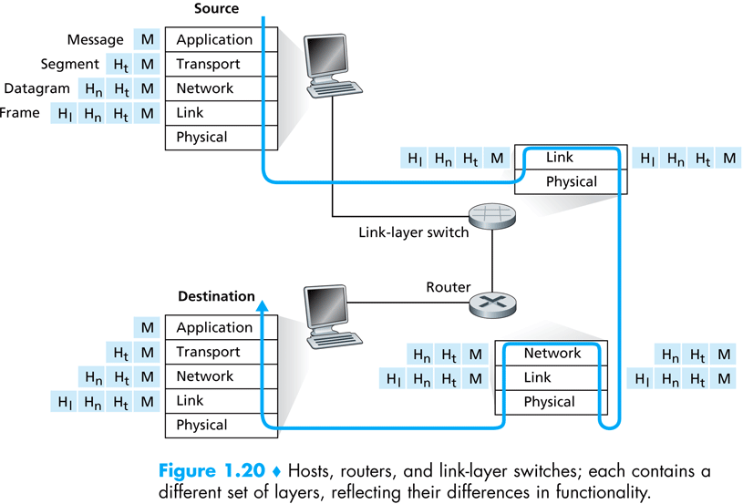
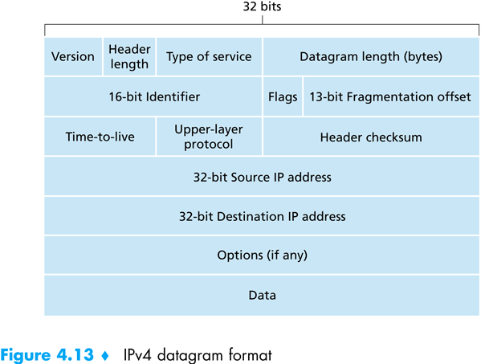
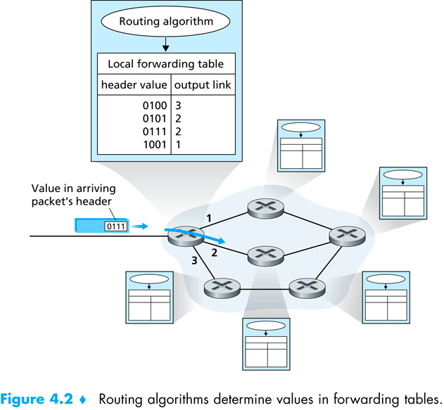
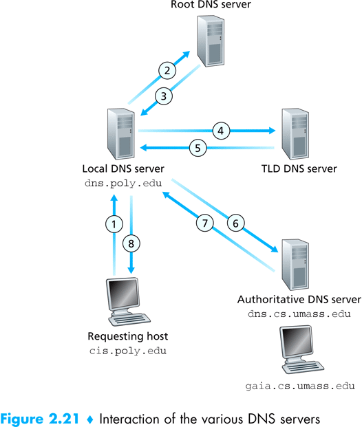
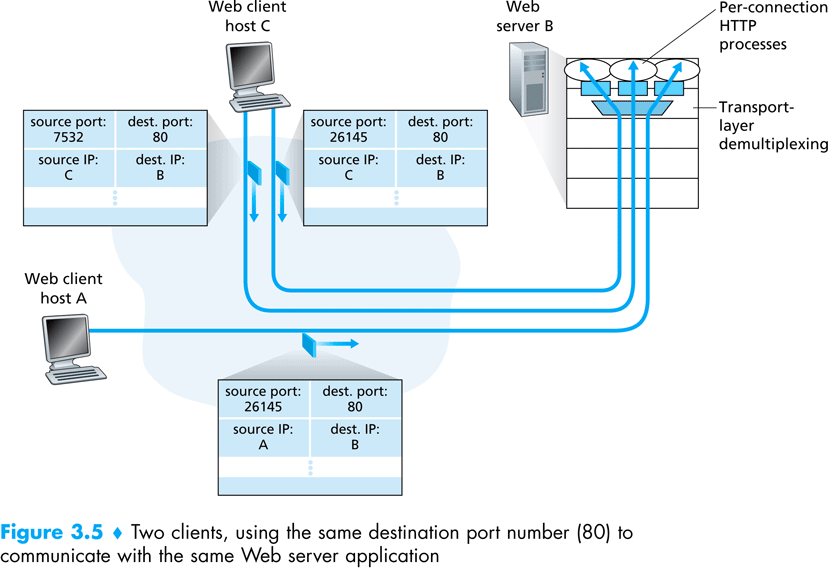
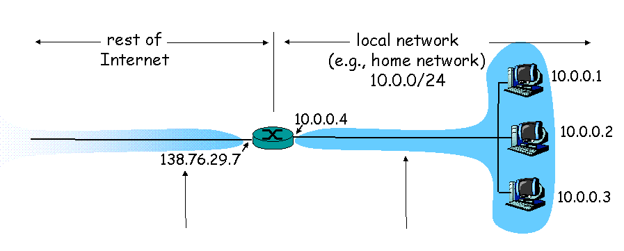

# **The Network Layer**

## **Objectives**

In this lecture we introduce some fundamental networking concepts. The lecture is by no means a comprehensive overview of modern networking, but contains the basics every programmer should be familiar with.

Until now, we have focused on application level communication and APIs. We have seen how applications use sockets (the API) to interchange information between them (the application level protocol). In this lecture, we will briefly present the protocols employed by the RTE to actually send the bytes from one physical computer to another, over a computer network.

## **Protocol Stack - the OSI Model**

The most prominent model used today for computer communication is the OSI model. The OSI model defines several layers of protocols, starting from the application's protocol (for example, HTTP), and ending at the physical protocol used to send bytes over the wire (for example, IEEE 802.*) . Each protocol in the stack builds on services given by the protocol below it.
The OSI model defines the following layers, from top to bottom:

1. The top layer is the application layer, which defines the protocol used by the application. In our examples from previous lectures, the line printing protocol is at the top of the stack.

2. The next layer is the transport layer, which deals with providing a means to reliably transfer data between applications. In our lectures, we used TCP as the transport layer.

3. Next comes the network layer, which deals with routing a piece of data to its correct recipient, passing information between hosts which do not necessarily share a physical medium.

4. The data link layer deals with transferring information between two hosts, connected by a physical medium.

5. The physical layer is in charge of sending bits of information over a physical medium. Usually implemented in the networking hardware.

The OSI model works like this: assume process A wishes to send a file to remote process B. Process A will ask the transport layer to send the file to process B. The transport layer will divide the file to manageable chunks, called packets, and ask the network layer to transfer the packets to process B's host. The network layer will decide which physically connected host the packets must be routed to, and send the packets to this host. This host is in charge of forwarding these packets to the next destination, until process B's host is reach. At each stage on the way, from process A's host to process B's host, the network layer employs the data link layer to transfer the packets between hosts, which, in turn, employs the physical layer to send the packets over the wire.

Figure taken from – Computer Networking: A Top Down Approach Featuring the Internet. Jim Kurose, Keith Ross:



In the rest of this lecture we focus on a network protocol implementation, called IP – the Internet Protocol. In the next lecture we will elaborate on a transport layer protocol, namely, TCP.

### **IP Protocol**

We will divide our discussion of the IP protocol into two complementary parts: packets and routing. Packets are the unit of data which the IP protocol transfers between hosts, and routing is the process of getting a packet to it's destination.

#### **IP Packets**

Packets are the integral data units which the IP protocol transmits between hosts. A packet is composed of two parts:

1. the packet header, which contains
  * the packet's header length
  * the total length, including the payload
  * a sequence number
  * control flags
  * time to live counter
  * the transport protocol employing IP which produced the packets' payload
  * the source IP address
  * the destination IP address
  * the header's checksum
2. the payload itself.

Figure taken from – Computer Networking: A Top Down Approach Featuring the Internet. Jim Kurose, Keith Ross:


The transport layer gives chunks of data to the network layer, and specifies where they need to be sent. The network layer wraps these chunks inside a packet, and then proceeds to send the packets to the destination. When the packets arrive at the destination, the network layer transfers the data chunks back to the transport layer of the destination, which then piece them together to form the original data which was sent.

Next, we will briefly discuss how the network layer ensures packets arrive at their destination.

### **Routing**

Each host connected to the internet has an internal routing table. A routing table is a simple lookup table, which translates destination addresses to next hop addresses; as the network layer is in charge of sending information between hosts, over the network, the information must pass on a physical route, in which every two hosts are connected by a physical medium. The routing tables are used, at each intermediate host, to find the next host to which the packet needs to be forwarded.

When the network layer on host H wishes to send a packet from source IP A to destination IP B, the following steps are followed:

1. Consult the internal routing table, and find the next hop, N, which is physically connected to H.
2. Decrease the Time to Live of the packet by one.
3. Forward the packet to H, by employing the data link layer.

Figure taken from – Computer Networking: A Top Down Approach Featuring the Internet. Jim Kurose, Keith Ross:


Another details which comes to mind is the size of the *routing table* at each host. Should each host know the next hop for each possible destination address? If so, the resulting routing table will be huge! To overcome this problem, routing is based on subnets; the internet is divided into subnets, which are connected in a tree-like structure. Each host knows its local subnet, and knows how to send packets to hosts in the same subnet. Moreover, each host contains a default gateway, which is the default destination to which the host forwards packets if the internal routing table of the host does not give a more specific next hop. These gateways employ several protocols (e.g., OSPF, BGP) which helps them locate routes using the tree like structure of the internet.

### **DNS**
As we have seen, IP uses addresses to identify hosts on the internet. However, as human beings, we find it more convenient to remember names than numbers (at least some of us). For example, when we want to contact some web server, say google, we do not want to remember the specific IP of google's web servers, but we want to be able to write "www.google.com" in the address bar of our browser, and expect the browser to do the correct thing; namely, somehow, magically, translate the name "www.google.com" to an IP. We call such a name a *domain name*.

The service which facilitates this goal is the DNS – the Domain Name Service, which is not part of the OSI protocol stack but deserves a section of its own.

#### **Domain Names**
We first start by dividing the network into domains. Each domain has a specific host which is responsible to translate domain names into IP addresses for this domain – called the name server. The top level domains are: com, org, edu, biz, il, us, gov, etcetera. Each domain may hold specific hosts inside the domain, or sub-domains of its own. For example, google.com is a sub domain of the com domain. Each sub domain is a domain of its own, has a name server, and may hold hosts or sub domains of its own. Each domain name is composed of the sub domains, separated buy a dot (.)

#### **Name Servers and Lookup**
Each host on the internet holds the name of a local name server, to which the host sends all translation requests. For example, when I try to translate the domain name www.google.com to an IP address, my host contacts the name server at 132.72.150.11 (notice that we must know the IP of the name server, not its domain name), and asks for translation. The name server then follows the DNS protocol to translate the domain name to an IP address. The process resembles walking up the tree of the sub domains, starting from the right-most domain (the top level domain), and asking each name server for the name server of the next sub domain, until we finally establish a contact with the name server of google.com, and as him for the address of the host named www.google.com.

Figure taken from – Computer Networking: A Top Down Approach Featuring the Internet. Jim Kurose, Keith Ross:


### **Demultiplexing**

Demultiplexing is the dispatching of datagrams performed by the transport layer on a TCP connection. As we haves seen a server socket port number is used by a client to initiate a connection, however it remain the same port number even after the server sokcet accepts the connection and returns a different port. The transport layers remembers the active TCP connections including the client IP and port. For each datagram the transport layer then looks at the sender address and port and demultiplex it to the new created port.



### **NAT**

NAT stands for: Network Address Translation. Its enables a local network to use one IP address as far as outside world is concerned. The benefits are: (a) A range of addresses for home devices is not necessarily needed from the ISP – just one IP address for all devices. (b) One can change addresses of devices in local network without notifying outside world. (c) One can change ISP without changing addresses of devices in local network

**Implementation**
NAT router must:

* outgoing datagrams – replace (source IP address, port #) of every outgoing datagram to (NAT IP address, new port #) so remote clients/servers will respond using (NAT IP address, new port #) as destination address.
* remember – In a NAT translation table every (source IP address, port #) to (NAT IP address, new port #) translation pair
* incoming datagrams – replace (NAT IP address, new port #) in dest fields of every incoming datagram with corresponding (source IP address, port #) stored in NAT table

An additional benefit is that devices inside local net not explicitly addressable, visible by outside world (a security plus).
However it comes with a price, a computer running a server behind a NAT is not accessible from the outside world. It can be solved using port forwarding. The interested reader is referred to wikipedia



### **Multicast**

A multicasting connection is characterized by 3 attributes:
* It is datagram-oriented.
* It is unreliable (which means: messages sent through the connection can be received *out of order on the other end).

It is point-to-group - that is, messages sent by one end are received by a whole group of connected clients.

**Java's MulticastSocket Classes**
In addition to ```DatagramSocket```, which lets programs send packets to one another, ```java.net``` includes a class called ```MulticastSocket```. This kind of socket is used on the client-side to listen for packets that the server broadcasts to multiple clients. On the server side, a regular ```DatagramSocket``` can be used. An important point is to use a multicasting IP address to refer to the group. Read the [Java Tutorial page on multicasting](http://java.sun.com/docs/books/tutorial/networking/datagrams/broadcasting.html)