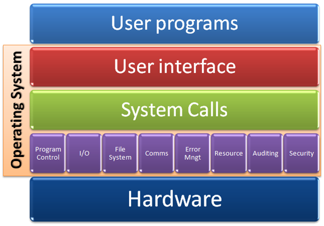

# **Run-Time Environments (RTE)**

One of the main objectives of this course is learning to be intelligent users of modern, sophisticated RTEs.

The general topics we will cover are:

1. What is a runtime environment (RTE)?
2. Management of memory in a RTE.
3. Management of concurrency in a modern RTE.
4. Communication and networking in a RTE.
5. Persistent data management in a RTE.

Across these topics we will learn:
1. Which standard tools and abstractions are provided by a modern RTE.
2. Understanding RTE limitations and costs.
3. How knowing your RTE helps choosing the right tools for each task.

We will compare various RTEs:
1. Unix and Windows Operating Systems.
2. Java Virtual Machine (JVM) .
3. Short examples of other RTEs - V8, CLR.

Let's start by giving examples of various RTEs, some you might not know were RTEs at all. For each RTE we will define which component plays the role of the RTE and which components are entities running inside the RTE.

## **The Operating System (OS)**

The operating system of a computer is a Run Time Environment (RTE). The entities running inside the operating system are called a processes.

### **Operating System Definition**

The operating system (OS) manages the sharing of the resources of a computer among processes. An operating system performs basic tasks such as controlling and allocating memory, controlling input and output devices, controlling CPU time, facilitating networking and managing file systems. Most services offered by the OS are abstracted as Objects (e.g., files and directories). The entity inside the OS that manages these resources (and more) is called the OS's Kernel, In order to interface with the kernel a process can use system calls system calls [^systemcalls].

[^systemcalls]: System calls are special low level functions which enable the interaction between the process and the operating system. For more details, see [here](http://en.wikipedia.org/wiki/System_call).

Block diagram of Operating System modules




### **Process Definition**

The main abstraction used by the operating system for an execution unit is a process[^process]. A process is an instance of a program, while it is executing. While a program itself is just a passive collection of instructions, a process is the actual execution of those instructions. There may exist many incarnations of the same program simultaneously, but each incarnation is a process on its own.

[^process]: You can think of a program as a cake recipe. A process is then what happens when an actual cake is created, using actual ingredients (resources), at a specific time and location.

### **Process / OS Interaction**

The nature of the interaction between the OS and the Process is about resource allocation. The OS is in charge of managing the computer resources between all of the processes it manages.

The main resources the OS offers and manages for all processes are:

* Memory
* **CPU time**
* Disk space
* Input and Output devices

The OS may also offer other services to processes, for example: communication through various communication medium (i.e., Wifi, Ethernet or 3G), location services (i.e, abstraction over a GPS service), notification services (an easy way to push notifications to the user from any process, regardless of the current focus of the user).

The OS interacts with processes in many different ways. The interaction process/OS can be partitioned into two categories:

* services which are initiated by the OS
* services which are requested by the process

Examples of services initiated by the OS include CPU and initial memory allocation (to load the code itself). Services which the process might request include request for more memory, allocation of disk space, access to external devices like mice and outputting to the screen.

### **Process Life Cycle**

The OS manages the life cycle of a process. Generally there are 3 main steps: Creating the process, managing the process and terminating the process.

In further detail we can describe the following steps:

[^shell]: A piece of software that provides an interface for users. Either a Command Line Interface (CLI) or a Graphical User Interface (GUI). [more](http://en.wikipedia.org/wiki/Shell_%28computing%29).

[^executable]: Executable files are generated with a compiler given the text of the program in a language such as C or C++

* The OS is asked by the user to create a process. This can be done, for example - through a shell[^shell].

* The OS identifies which program (= executable file[^executable]) is to be executed to create the process. This is a file that contains instructions to be executed on the CPU to activate the process. The format of executable files is specified by the OS.

* The OS creates a process instance from the executable. This instance is identified by its process ID, which is unique among all running processes. All information about running processes is maintained by the OS in a process table.

* The OS allocates memory for the new process in the computer's main memory (RAM).

* The OS loads the instructions from the program executable file into main memory.

* The OS identifies the starting function in the program (e.g., "main" in C and C++) and invokes it (calls the function). The main function receives arguments passed from the OS. These are called the command line arguments.

* From that point on, the instructions of the main function are executed as specified in the program.

* When the process invokes a system call (that is, the program executes a line such as ```printf("Hello");```, which initiates a system call to print to the screen), the process is interrupted until the OS executes the service requested. This means that each time a system call is invoked, the process undergoes a context switch.

* When the process executes the special system call exit, the process is terminated: memory and all other resources allocated to the resource are freed, the process ID is freed and the process entry is removed from the OS process table.

When we write a program, we must understand the difference between calling a regular function, defined in the program, and invoking a system call. They superficially look the same (that is, calling the function f(1, 2); and (indirectly) invoking a system call via printf("Hello"); seem to be doing the same thing. But a system call invocation is completely different from a function call.

The interface between a program and the OS is defined as a set of system calls, each with its own parameters. For modern OSes such as Linux or Windows, there are a few hundreds to a few thousands system calls defined.

The following Figure summarizes the main elements involved when an OS RTE creates a process.


### **CPU Time Sharing**

The CPU is the main resource shared by all processes, which can only execute machine code sequentially, one instruction at a time. To support multiple processes executing concurrently, the OS needs to **share** the CPU between all these processes. This sharing of CPU time is termed *multitasking*.

Albeit being a nice property to have, multitasking has its price. It takes time to tell the CPU to stop executing one process and switch to another one. The act of switching between processes is called a *context switch*. In modern OSs, running on modern CPUs, a context switch usually takes around ~10 microseconds (compare with the time it takes to execute a single computation step - close to 1 nanosecond, that is, a context switch takes as long as 10,000 instructions). The entity inside the OS which is in charge of selecting which process will be executed next is called the *scheduler*.

Processes may be in several *states*. A process may either be running, if it is currently executed by one of the CPUs in the machine or, otherwise, waiting. Waiting is further divided to:

* waiting for CPU time (because all the CPUs in the machine are busy executing instructions for other processes)

* waiting for Input-Output to complete (this is because an Input/Output operation is much slower than a CPU operation)

* waiting for an event (because the process is waiting for another process to reach a certain state before it can continue)

### **Summary**

The Operating System is an example of a basic but complex RTE. It is the basic interface between the user code and the hardware of the machine hosting the user code. Using abstractions like a "process" which is a collection of variables: state, current execution point, current resources, the OS can create the feeling of simultaneous execution of multiple processes.

### **Interpreted vs. Compiled to binary Language And their RTE**

Programing languages can be categorized as:

1. Designed to be executed using an interpreter: Python (CPython), Bash, etc. In that case their interpreter is part of their RTE.
2. Directly processed by the machine CPU (native code): C, C++, etc. In that case the operating system is part of their RTE
3. Hybrid - starts with interpreted code and compiled to native code on the fly: Java, Javascript over V8. In that case their interpreter is part of their RTE.

Since we do not write machine code directly, a compiler and a linker are needed to create the machine code from our text files. Interpreted languages can be compiled as well to an intermediate language (like bytecode in the case of Java), but eventually, interpretation of the instructions into machine code is performed on the fly, as the code is executed.

In the cases where the interpreter supplies all the required services and hides the underlying machine behind an abstraction layer, the interpreter plays the role of an RTE. Examples are .NET's CLR and the JVM.

Interpreted languages are usually easier to learn and master than compiled one, because interpreters are often offer higher level of abstraction and in some cases allows the programmer to interact with them and test on the fly code modifications, without the need to recompile and restart the program. An interpreter which also plays the role of an RTE provides portability as well: your code may be executed on any hardware/OS for which the interpreter was implemented. On the other hand, portability means your code depends on the interpreter - it is not "standalone".

One of the advantages counted for binary code (non-interpreted) is speed. Binary code runs faster than interpreted code. However when considering an RTE that performs runtime optimizations, and considering the difficulty in writing good and optimized code in a compiled language, the execution speed may not always be in favor of binary code.

## **The Java Virtual Machine (JVM)**

The Java virtual machine[^virtualmachine] is an RTE. It executes Java classes.

[^virtualmachine]: Increasingly, computers can run a basic OS and embedded virtual machines. A virtual machine is a completely isolated guest OS that runs within a normal OS. [more](http://en.wikipedia.org/wiki/Virtual_machine)

The JVM simulates a complete machine, on which Java programs are executed. When we compile a Java source file, we create a file which contains instructions specific for the JVM, called *byte code*. This is equivalent to the process of compiling a regular C/C++ program into regular machine code.

The JVM byte code is then interpreted. This gives Java some nice properties we will encounter throughout the course. The most prominent one is that Java programs are *portable*; a Java program compiled on any architecture can be interpreted on any other architecture given that an implementation of the JVM for the destination architecture exists. For almost all known architectures there exists a Java interpreter (a JVM) implementation. The JVM also contain a Just-In-Time (JIT) compiler - while the JVM interpreting the program byte code - the JIT learns about "hot spots" which are code parts that executed often, it then compiles these "hot spots" on the fly to an optimized native code - this JIT is what allows the JVM to have a performance characteristics that is in many cases comparable with native code.

The JVM is itself a process inside some RTE (in general an OS RTE), and acts as an intermediate level between the interpreted program and the RTE. (The JVM is concretely an executable program called java.) In contrast to the mechanism of system calls in which a process must call functions to interact with the OS, a Java program interacts with the JVM using the object oriented paradigm. For example one can have an object File. during the creation of the object the JVM might call the system call openFile (that is, the JVM works as an adaptor between the Java Object-oriented world and the OS system-calls world).

The interface between the JVM and Java programs (that is, the abilities given to the program by the JVM) is described in the Java language. For example, consider the object ```System.out```, which you use to print strings to the screen. It is an object that represents the JVM support for printing. Similarly, the JVM supports security models, communications, distributed objects and more.


### **A Java Program Lifecycle**

A program written in Java is compiled into a set of files, in a format called "class". For example, given a **text** file ```P.java```, the compiler generates a java **byte code** file ```P.class```. The class file format is a standard specified as part of the JVM specification.

The JVM manages the lifecycle of a Java process in the following manner:

* The JVM is invoked with a parameter which refers to a class file. For example, ```java P.class```.
* The JVM starts running as a process inside the OS. The JVM then activates, inside this process, the following operations.
* The JVM loads the class file.
* In order to start execution, the JVM identifies a method with signature ```static Main(String args[])``` in the executed class file. The JVM parses the command line parameters that appear after the name of the class path in the main command line, and then invokes the ```main``` method with these parameters.
* During the execution of code in the class, if it refers to other classes, the JVM also loads the other classes This mechanism is recursive (that is, the newly loaded class may load another class and so on).
* When the Java program requires a service from the JVM, it invokes the corresponding method from the JVM interface. In general, the JVM services are located in the ```System``` package.
* A java program also use some jvm services indirectly - like garbage collection
* When the program executes the ```System.exit``` method, the JVM cleans up all the resources allocated to the program and then the JVM process is terminated.

Note that in the description above, the Java program interacts with the JVM exclusively - it never invokes a system call. Instead, it calls methods from Object Oriented interfaces which are part of the Java standard environment. When the JVM executes the code corresponding to such a service request, it translates it into the appropriate system call to the containing OS.

We will see in the next lectures that a single JVM process can execute more than one Java class simultaneously. Naturally, it is also possible to run several instances of the JVM in the same OS.

The following figure summarizes the main elements involved when the JVM creates a process inside an OS RTE:


## **Examples of other RTEs**

### **V8**

V8 is Google's open source high-performance JavaScript engine, written in C++ and used in Google Chrome. When running inside chrome, unlike the other RTE's that we discussed, it execute programs inside a sandbox and only expose small amount of services from the underlying OS e.g., managed memory access, very limited interaction with the file-system and limited network capabilities. These limitations are introduced for security reasons as V8 execute any javascript programs that received from the server that serves the web-pages that the user is browsing.

### **CLR**

The Common Language Runtime (CLR) is the component parallel to the JVM for the .Net framework. It provides capabilities similar to the JVM but although it was recently open sourced it is yet to support or only have limited support for all the operating systems supported by the JVM.

## **Summary**

The programs we write interact with the environment that executes them and their behavior is defined by this interaction.
The interface between the program and the RTE is bi-directional: the program invokes services provided by the container, and the container can send events or change the state of the process as it is running.

The main responsibilities of an RTE include:

1. Process management (creation, initialization, destruction)
2. Storage management (memory, file, dbms)
3. Communication management
4. Hardware/Devices management
5. Security

There is a wide range of different RTEs (OSes such as Linux or Windows, JVM, applet container, servlet container, distributed RTEs) but the structure of the interface between a program and its container remains quite stable.
