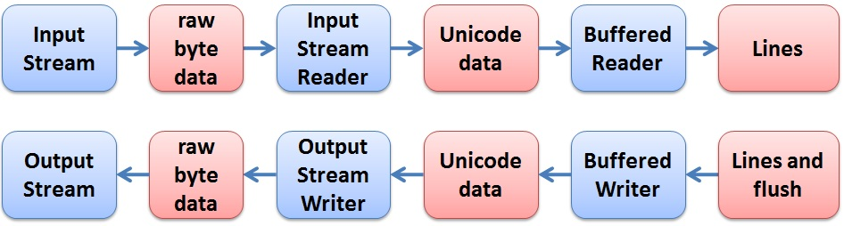

# Practical Session 9  - Networking

## Table of contents
- [Practical Session 9  - Networking](#practical-session-9----networking)
  - [Table of contents](#table-of-contents)
  - [Introduction](#introduction)
    - [Internet Protocol: IP Addresses](#internet-protocol-ip-addresses)
    - [TCP/IP model](#tcpip-model)
    - [Restricted IP addresses](#restricted-ip-addresses)
    - [Domain Name System (DNS)](#domain-name-system-dns)
    - [Internet Servers and Clients](#internet-servers-and-clients)
    - [Ports](#ports)
    - [Network console tools](#network-console-tools)
    - [Sockets](#sockets)
  - [TCP and UDP transport layer protocols](#tcp-and-udp-transport-layer-protocols)
    - [Datagram vs. Stream](#datagram-vs-stream)
    - [Datagram Communication](#datagram-communication)
    - [Stream Communication](#stream-communication)
    - [TCP/UDP Overhead](#tcpudp-overhead)
  - [The Client-Server Model](#the-client-server-model)
    - [1. Simple Line Printer](#1-simple-line-printer)
      - [Server code](#server-code)
      - [Client code](#client-code)
    - [2. Encoding and Decoding](#2-encoding-and-decoding)
      - [Server Code: (EchoServer)](#server-code-echoserver)
      - [Client Code (EchoClient)](#client-code-echoclient)
    - [3. Protocol Interface](#3-protocol-interface)
    - [4. Http Client](#4-http-client)
  - [Useful Links](#useful-links)

## Introduction

### Internet Protocol: IP Addresses

The [Internet](https://en.wikipedia.org/wiki/Internet) is a global system of interconnected computer networks, it is a network of networks that consists of millions of private and public, academic, business, and government networks of local to global scope that are linked by a broad array of electronic and optical networking technologies.

Every machine on the Internet has a unique identifying number, called an [IP Address](https://en.wikipedia.org/wiki/IP_address). The IP stands for Internet Protocol, which is the language that computers use to communicate over the Internet. The original designers of TCP/IP defined an IP address as a 32-bit number and this system, known as Internet Protocol Version 4 or IPv4, is still in use today. However, due to the enormous growth of the Internet and the resulting depletion of available addresses, a new addressing system (IPv6), using 128 bits for the address, was developed in 1995.

IPv4 addresses are usually represented in dot-decimal notation (four numbers, each ranging from 0 to 255). Each part represents 8 bits of the address, and is therefore called an octet.

- Protocol – rules of conversation.
- A typical IP address (decimal format) - 216.27.61.137 
- A typical IP address (binary format) - 11011000.00011011.00111101.10001001 

### TCP/IP model

The [TCP/IP](https://en.wikipedia.org/wiki/Internet_protocol_suite) is a description framework for [Communication protocol](https://en.wikipedia.org/wiki/Communication_protocol). TCP/IP provides end-to-end connectivity specifying how data should be formatted, addressed, transmitted, routed and received at the destination. TCP/IP is generally described as having four abstraction layers:

- Link Layer  
- Internet Layer 
- Transport Layer 
- Application Layer  


### Restricted IP addresses

- **0.0.0.0** - is reserved for the default network 
- **255.255.255.255** - is used for broadcasts (Messages that are intended for all computers on a network). 
- **127.0.0.1 (Loopback)** - is used as the loopback address. This means that it is used by the host computer to send a message back to itself. Also aliased as localhost. 

### Domain Name System (DNS)

Remembering IP addresses is hard for humans. The [DNS](https://en.wikipedia.org/wiki/Domain_Name_System) service maps text names to IP addresses automatically. For example: `www.cs.bgu.ac.il` &rarr; `132.72.118.165`

An often-used analogy to explain the Domain Name System is that it serves as the "phone book" for the Internet by translating human-friendly computer hostnames into IP addresses.

When you use the browser, it will send a DNS query (or use the cache) in order to translate the domain to IP address. You can also send such queries using `nslookup` tool.  
  

### Internet Servers and Clients

All of the machines on the Internet are either servers or clients (or both). The machines that provide services to other machines are servers. And the machines that are used to connect to those services are clients. A server has a static IP address that does not change very often. A home machine that is dialing up through a modem typically has a dynamic IP address - A session-unique IP address assigned by the [Internet Service Provider (ISP)](https://en.wikipedia.org/wiki/Internet_service_provider) (usually assigned by a server using [Dynamic Host Configuration Protocol (DHCP)](https://en.wikipedia.org/wiki/Dynamic_Host_Configuration_Protocol) every time you dial in (could be different the next time you dial in).


### Ports

Any server machine makes its services available using numbered [ports](https://en.wikipedia.org/wiki/Port_(computer_networking)) - one for each service that is available on the server. Think of the IP:Port combo as this: The IP is the building address, where the Port denotes which apartment is in that building. In our world, IP is the computer machine, whereas the Port is the application that listens to it and can send and receive messages through it.

For example, if a server machine is running a Web server and a file transfer protocol (FTP) server, the Web server would typically be available on port 80, and the FTP server would be available on port 21 ([List of TCP and UDP port numbers](https://en.wikipedia.org/wiki/List_of_TCP_and_UDP_port_numbers)). Clients connect to a service at a specific IP address and on a specific port number. Once a client has connected to a service on a particular port, it accesses the service using a specific protocol. Protocols are often text and simply describe how the client and server will have their conversation.

Port numbers can run from 0 to 65353. Port numbers from 0 to 1023 are reserved for common TCP/IP applications and are called well-known ports.

### Network console tools

- [Ipconfig](https://en.wikipedia.org/wiki/Ipconfig) (Microsoft Windows console application) – displays all current TCP/IP network configuration values. 
- [ifconfig](http://en.wikipedia.org/wiki/Ifconfig) (Unix-like console application) - configure, control, and query TCP/IP network interface parameters. 
- [ping](http://en.wikipedia.org/wiki/Ping) (Unix-like & Windows) - utility used to test whether a particular host is reachable across an Internet Protocol (IP) network and to measure the round-trip time for packets sent from the local host to a destination computer.
- [Telnet client](http://en.wikipedia.org/wiki/Telnet) (Unix-like & Windows) - Telnet is a network protocol used to provide a bidirectional interactive communications facility. Typically, telnet provides access to a command-line interface on a remote host via a virtual terminal connection. Putty can be used on recent Windows-es which don't have telnet. 
- [cURL](http://en.wikipedia.org/wiki/CURL) is a computer software project providing a library and command-line tool for transferring data using various protocols. 
- [nslookup](https://en.wikipedia.org/wiki/Nslookup) (Unix-like & Windows) - command-line tool for querying the DNS to obtain the mapping between domain name and IP address, or other DNS records.
  

### Sockets

Sometimes your applications require low-level communication, for example connecting to a database or implementing instant messaging. Networking allows processes running on different hosts to exchange messages. Message destinations are specified as [socket](https://en.wikipedia.org/wiki/Network_socket)  addresses; each socket address is a communication identifier that consists of a port number and an Internet address. When messages are sent, they are queued at the sending socket until the underlying network protocol has transmitted them. When they arrive, the messages are queued at the receiving socket until the receiving process makes the necessary calls to receive them.

  
## TCP and UDP transport layer protocols

### Datagram vs. Stream

[Transport Layer](http://en.wikipedia.org/wiki/Transport_Layer) is a group of methods and protocols within a layered architecture of network components. There are two communication protocols that one can use for socket programming: datagram communication (UDP) and stream communication (TCP). In this practical session, we focus on session-oriented, reliable connections implemented by the TCP protocol and used through the socket interface.

  
### Datagram Communication

The datagram communication protocol, known as UDP (user datagram protocol), is a connectionless protocol. It means that a datagram can be sent at any moment without prior connection preparation as in TCP. You just send the datagram and hope the receiver is able to handle it.

There is absolutely no guarantee that the datagram will be delivered to the destination host. In reality, the failure rate is very low on the Internet and nearly null on a LAN unless the bandwidth is full. Not only the datagram can be undelivered, but it can be delivered in an incorrect order. It means you can receive a packet before another one, even if the second has been sent before the first you just received. You can also receive the same packet twice.

The main advantages of UDP are that you can broadcast, and it is fast. The main disadvantage is unreliability and therefore complicated the program at the application level.


### Stream Communication

- Stream-oriented communication is a form of communication in which timing plays an important role.  
- Stream-oriented communication is also referred to as continuous streams of data
   

    

[Stream](https://en.wikipedia.org/wiki/Stream_(computing))

The stream communication protocol is known as TCP (transfer control protocol). Unlike UDP, TCP is a connection-oriented protocol. In order to do communication over the TCP protocol, a connection must first be established between the pair of sockets. While one of the sockets listens for a connection request (server), the other asks for a connection (client). Once two sockets have been connected, they can be used to transmit data in both (or either one of them) directions.

Being stream-oriented means that the data is a plain byte sequence. The receiver has no means of knowing how the data was actually transmitted. The sender can send many small data chunks and the receiver receive only one big chunk, or the sender can send a big chunk, the receiver receiving it in a number of smaller chunks. The only thing that is guaranteed is that all data sent will be received without any error and in the correct order. If any error occurs, it will automatically be corrected (retransmitted as needed) or the error will be notified if it can’t be corrected. The following diagram presents the way we will handle text streams in java:

  

 This illustrates the duplex communication model:

  

 The main advantages of TCP are that it guarantees three things: correctness, order, and no duplication. The main disadvantage is that it cannot be used for broadcast or multicast transmission. In addition, it might have a bad throughput on high-latency links.

### TCP/UDP Overhead

The following image illustrates the header size for TCP and UDP packets:

 

(source: [http://microchip.wikidot.com/tcpip:tcp-vs-udp](http://microchip.wikidot.com/tcpip:tcp-vs-udp)) 

It is quite evident that the TCP header (sent along with each data packet!) is _significantly_ larger than the UDP header. This creates additional overhead, reducing the throughput of TCP communication.


## The Client-Server Model

<!-- **Note: you can find the code on this page [here](https://gist.github.com/nirbar8/be294dd2fc74338192549b8ecbe83e87) (better format)** -->

The client-server is a very common model in many networking applications. The server provides some services, such as processing database queries or sending out current stock prices. The client uses the service provided by the server, either displaying database query results to the user or making stock purchase recommendations to an investor. A socket connection based on top of a TCP connection is symmetric between the two ends - except for the connection establishment stage. To establish a connection, the model determines that:

1.  The server waits for connection requests from clients.  
2.  The server only reacts to the initiative of the client.
3.  To remain available for further connections, the server does not open the connection directly with the client on the incoming socket. Instead, it creates a private socket that the client can keep connected to for the whole period of the session. 

Servers must be built to maximize availability – that is, they must handle requests for connections as fast as possible and then return to the mode where they can receive and handle more requests from other clients. 

----------

There are four examples. In each example, you will find code for the client and for the server. Compile both files and open two console windows. Place them so you can see them both. First, run the server and supply the server with a port to listen at, for example

 ****> java LPServer 4444****

Then run the client, and provide it with the hostname and the port of the server. For example, if you use the same machine for both, then

 ****> java LPClient localhost 4444****

If the server runs on a different machine replace "localhost" (or 127.0.0.1) with the server computer name or IP.

### 1. Simple Line Printer

A very simple client-server application. The server begins listening for a single client. Once the client connects it establishes a UTF-8 text-based encoder-decoder that returns a message upon reception of a newline symbol ('\\n').

The LP protocol is that any message from the client is printed on the screen by the server. If the message 'bye' is received, the server closes the connection.

#### Server code

```java
import java.io.*;
import java.net.*;

class LPServer {

    public static void main(String[] args) throws IOException
    {
        ServerSocket lpServerSocket = null;

        // Get port
        int port = Integer.decode(args[0]);

        // Listen on port
        try {
            lpServerSocket = new ServerSocket(port);
        } catch (IOException e) {
            System.out.println("Couldn't listen on port " + port);
            System.exit(1);
        }

        System.out.println("Listening...");

        // Waiting for a client connection
        Socket lpClientSocket = null;
        try {
            lpClientSocket = lpServerSocket.accept();
        } catch (IOException e) {
            System.out.println("Failed to accept...");
            System.exit(1);
        }

        System.out.println("Accepted connection from client!");
        System.out.println("The client is from: " + lpClientSocket.getInetAddress() + ":" + lpClientSocket.getPort());

        // Read messages from client
        BufferedReader in = new BufferedReader(new InputStreamReader(lpClientSocket.getInputStream()));
        String msg;

        while ((msg = in.readLine()) != null)
        {
            System.out.println("Received from client: " + msg);
            if (msg.equals("bye"))
            {
                System.out.println("Client sent a terminating message");
                break;
            }
        }

        System.out.println("Client disconnected - bye bye...");

        lpServerSocket.close();
        lpClientSocket.close();
        in.close();
    }
}
```

            

#### Client code

```java
import java.io.*;
import java.net.*;

public class LPClient {
    public static void main(String[] args) throws IOException
    {
        Socket clientSocket = null; // the connection socket
        PrintWriter out = null;

        // Get host and port
        String host = args[0];
        int port = Integer.decode(args[1]);

        System.out.println("Connecting to " + host + ":" + port);

        // Trying to connect to a socket and initialize an output stream
        try {
            clientSocket = new Socket(host, port); // host and port
            out = new PrintWriter(clientSocket.getOutputStream(), true);
        } catch (UnknownHostException e) {
            System.out.println("Unknown host: " + host);
            System.exit(1);
        } catch (IOException e) {
            System.out.println("Couldn't get I/O to " + host + " connection");
            System.exit(1);
        }

        System.out.println("Connected to server!");

        String msg;
        BufferedReader userIn = new BufferedReader(new InputStreamReader(System.in));
        BufferedReader in = null;
        // Initialize an input stream
        try {
            in = new BufferedReader(new InputStreamReader(clientSocket.getInputStream(),"UTF-8"));
        } catch (IOException e) {
            System.out.println("Couldn't get input to " + host + " connection");
            System.exit(1);
        }
        while ((msg = userIn.readLine())!= null)
        {
            out.println(msg);
            if(msg.indexOf("bye") >= 0){
                break;
            }
            System.out.println(in.readLine());
        }

        System.out.println("Exiting...");

        // Close all I/O
        out.close();
        userIn.close();
        clientSocket.close();
    }
}
```


### 2. Encoding and Decoding

Different computers, run time environment languages, and compilers can use different symbols representation. If we want to communicate we need uniform coding for the symbols. Since we are transferring objects larger than a single byte (integers, chars, strings) over streams of bytes, we need to encode them. Even for Strings: Should we run on one side \
  `java -Dfile.encoding=US-ASCII LPServer 4500`

and on another  \
  `java LPClient localhost 4500 (assuming default UTF-8)`

any text which has characters not included in the similar 127 first characters in the encodings is not transferred correctly (e.g. Hebrew). We can notice other problems using UTF-16 and UTF-32 (for example line endings are no longer recognized as message ends since they have different numerical values).


We can also see that Unicode strings have different lengths when represented in different encodings:

  
```java
import org.junit.*;
import static org.junit.Assert.*;

public class TestEncodings {
  @Test 
  public void testAll() throws Exception {
    String  s = "dד\\( \\Delta \\)"; //MATHEMATICAL BOLD CAPITAL DELTA 1D6AB
    assertEquals(4, s.length()); //length of a UTF-32 string in UTF-16
    assertEquals(3, s.codePointCount(0, s.length())); //length by codepoints (actual letters)
    assertEquals(7, s.getBytes("UTF-8").length); //length in bytes (based on given encoding UTF-8)
  }
}   

```

In the next example, the client and the server communicate using the "UTF-8" format. You will learn more about Encoding in the lectures. This time, the server sends the client back the message it received using UTF-8. We create the readers and writers with the encoding specified as follows:

```java
...
in = new BufferedReader(new InputStreamReader(clientSocket.getInputStream(),"UTF-8")); 
...  
out = new PrintWriter(new OutputStreamWriter(clientSocket.getOutputStream(), "UTF-8"), true);  
...   
```

Note that "UTF-8" is the default encoding of `InputStreamReader` and `OutputStreamWriter` so we did not actually have to indicate that in the previous code.

  

#### Server Code: (EchoServer)

Same Encoding and Decoding as in LPServer. The protocol is slightly different, this time if the message isn't 'bye' the server will return the message sent by the client, back to him.

```java
import java.io.*;
import java.net.*;

class EchoServer {

  private BufferedReader in;
  private PrintWriter out;
  ServerSocket echoServerSocket;
  Socket clientSocket;
  int listenPort;

  public EchoServer(int port) {
    in = null;
    out = null;
    echoServerSocket = null;
    clientSocket = null;
    listenPort = port;
  }

  // Starts listening
  public void initialize() throws IOException {
    // Listen
    echoServerSocket = new ServerSocket(listenPort);
    System.out.println("Listening...");

    // Accept connection
    clientSocket = echoServerSocket.accept();
    System.out.println("Accepted connection from client!");
    System.out.println(
      "The client is from: " +
      clientSocket.getInetAddress() +
      ":" +
      clientSocket.getPort()
    );

    // Initialize I/O
    in =
      new BufferedReader(
        new InputStreamReader(clientSocket.getInputStream(), "UTF-8")
      );
    out =
      new PrintWriter(
        new OutputStreamWriter(clientSocket.getOutputStream(), "UTF-8"),
        true
      );
    System.out.println("I/O initialized");
  }

  public void process() throws IOException {
    String msg;

    while ((msg = in.readLine()) != null) {
      System.out.println("Received \"" + msg + "\" from client");

      if (msg.equals("bye")) {
        out.println("Ok, bye bye...");
        break;
      } else {
        out.print(msg + "\n");
        out.flush();
      }
    }
  }

  // Closes the connection

  public void close() throws IOException {
    in.close();
    out.close();
    clientSocket.close();
    echoServerSocket.close();
  }

  public static void main(String[] args) throws IOException {
    // Get port int

    int port = Integer.decode(args[0]).intValue();
    EchoServer echoServer = new EchoServer(port);

    // Listen on port
    try {
      echoServer.initialize();
    } catch (IOException e) {
      System.out.println("Failed to initialize on port " + port);
      System.exit(1);
    }

    // Process messages from client
    try {
      echoServer.process();
    } catch (IOException e) {
      System.out.println("Exception in processing");
      echoServer.close();
      System.exit(1);
    }

    System.out.println("Client disconnected - bye bye...");
    echoServer.close();
  }
}
```


#### Client Code (EchoClient)

```java
import java.io.*;
import java.net.*;

public class EchoClient {

  public static void main(String[] args) throws IOException {
    Socket clientSocket = null;
    // the connection socket PrintWriter out = null;
    BufferedReader in = null;
    // Get host and port String host = args[0];
    String host = args[0];
    int port = Integer.decode(args[1]).intValue();
    System.out.println("Connecting to " + host + ":" + port);
    
    PrintWriter out = null;
    // Trying to connect to a socket and initialize an output stream
    try {
      clientSocket = new Socket(host, port);
      // host and port
      out =
        new PrintWriter(
          new OutputStreamWriter(clientSocket.getOutputStream(), "UTF-8"),
          true
        );
    } catch (UnknownHostException e) {
      System.out.println("Unknown host: " + host);
      System.exit(1);
    } catch (IOException e) {
      System.out.println("Couldn't get output to " + host + " connection");
      System.exit(1);
    }
    // Initialize an input stream
    try {
      in =
        new BufferedReader(
          new InputStreamReader(clientSocket.getInputStream(), "UTF-8")
        );
    } catch (IOException e) {
      System.out.println("Couldn't get input to " + host + " connection");
      System.exit(1);
    }
    System.out.println("Connected to server!");
    String msg;
    BufferedReader userIn = new BufferedReader(
      new InputStreamReader(System.in)
    );
    while ((msg = userIn.readLine()) != null) {
      out.println(msg);
      System.out.println(in.readLine());
    }
    System.out.println("Exiting...");
    // Close all I/O
    out.close();
    in.close();
    userIn.close();
    clientSocket.close();
  }
}
```
  

### 3. Protocol Interface

We don’t want to hold the implementation of a protocol inside the server’s code. It is complicated enough that it has to handle the communication, and not testable while a protocol usually follows a specification. We would like to have the protocol implemented somewhere else. For that purpose, we define an interface **MessagingProtocol** which has a single method for protocol processing: **process** - for processing the received message and constructing a response message Note that since we have an independent protocol processor we can hold the protocol’s state. Once again we have an Echo Server, but this time, in addition to sending back the message it is also numbered.

```java
interface ServerProtocol {
    String processMessage(String msg);
    boolean isEnd(String msg);
}
```

```java
class EchoProtocol implements ServerProtocol {

        private int counter;

        public EchoProtocol()
        {
            counter = 0;
        }

        public String processMessage(String msg)
        {
            counter++;

            if (isEnd(msg))
                return new String("Ok, bye bye...");
            else
                return new String(counter + " Received \"" + msg + "\" from client");
        }

        public boolean isEnd(String msg)
        {
            return msg.equals("bye");
        }
    }
```

```java
class ProtocolServer {

    private BufferedReader in;
    private PrintWriter out;
    ServerSocket echoServerSocket;
    Socket clientSocket;
    int listenPort;
    ServerProtocol protocol;

    public ProtocolServer(int port, ServerProtocol p)
    {
        in = null;
        out = null;
        echoServerSocket = null;
        clientSocket = null;
        listenPort = port;
        protocol = p;
    }

    // Starts listening
    public void initialize() throws IOException
    {
        // Listen
        echoServerSocket = new ServerSocket(listenPort);

        System.out.println("Listening...");

        // Accept connection
        clientSocket = echoServerSocket.accept();

        System.out.println("Accepted connection from client!");
        System.out.println("The client is from: " + clientSocket.getInetAddress() + ":" + clientSocket.getPort());

        // Initialize I/O
        in = new BufferedReader(new InputStreamReader(clientSocket.getInputStream(), "UTF-8"));
        out = new PrintWriter(new OutputStreamWriter(clientSocket.getOutputStream(), "UTF-8"), true);

        System.out.println("I/O initialized");
    }

    public void process() throws IOException
    {
        String msg;

        while ((msg = in.readLine()) != null)
        {
            System.out.println("Received \"" + msg + "\" from client");

            String response = protocol.processMessage(msg);
            if (response != null)
            {
                out.println(response);
            }

            if (protocol.isEnd(msg))
            {
                break;
            }

        }
    }

    // Closes the connection
    public void close() throws IOException
    {
        in.close();
        out.close();
        clientSocket.close();
        echoServerSocket.close();
    }

    public static void main(String[] args) throws IOException
    {
        // Get port
        int port = Integer.decode(args[0]).intValue();

        ProtocolServer server = new ProtocolServer(port, new EchoProtocol());

        // Listen on port
        try {
            server.initialize();
        } catch (IOException e) {
            System.out.println("Failed to initialize on port " + port);
            System.exit(1);
        }

        // Process messages from client
        try {
            server.process();
        } catch (IOException e) {
            System.out.println("Exception in processing");
            server.close();
            System.exit(1);
        }

        System.out.println("Client disconnected - bye bye...");

        server.close();
    }
}
```

### 4. Http Client

[Hypertext Transfer Protocol](http://en.wikipedia.org/wiki/Hypertext_Transfer_Protocol) is an application protocol for distributed, collaborative, hypermedia information systems. We can see a few attributes of many communication protocol designs. \
An HTTP request is defined as a header, followed by an empty line and an optional body. The request includes the protocol version. An HTTP response is defined as a header, followed by an empty line and an optional body. The response may end after the body, or in HTTP/1.1 each response may contain either a Content-Length header field indicating the number of bytes for the response or a response with [Chunked transfer encoding](https://en.wikipedia.org/wiki/Chunked_transfer_encoding) with each chunk containing the chunk size.

```java
import java.io.*;
import java.net.*;

public class Http {

  public static void main(String[] args) throws Exception {
    String host = args[0];

    try (
      Socket lp = new Socket(host, 80);
      PrintWriter out = new PrintWriter(
        new OutputStreamWriter(lp.getOutputStream(), "UTF-8"),
        true
      );
      BufferedReader in = new BufferedReader(
        new InputStreamReader(lp.getInputStream(), "UTF-8")
      )
    ) {
      out.print("GET / HTTP/1.0\r\n" + "Host: " + host + "\r\n" + "\r\n");

      out.flush();

      String msg = in.readLine();
      while (msg != null) {
        System.out.println(msg);
        msg = in.readLine();
      }
    } catch (Exception e) {
      System.out.println("Error: " + e);
    }
  }
}
```

## Useful Links

*   [Sun tutorial on sockets](https://docs.oracle.com/javase/tutorial/networking/sockets/index.html) 
*   [Java work on sockets](http://www.javaworld.com/javaworld/jw-12-1996/jw-12-sockets.html)  
*   [A guide to java sockets](https://www.baeldung.com/a-guide-to-java-sockets)
*   [TCP/IP Protocol Architecture](http://docstore.mik.ua/orelly/networking/tcpip/ch01_03.htm)  
*   [Firewall](http://en.wikipedia.org/wiki/Firewall) (Explanation for what to look out if you test with multiple computers and get no connection)
