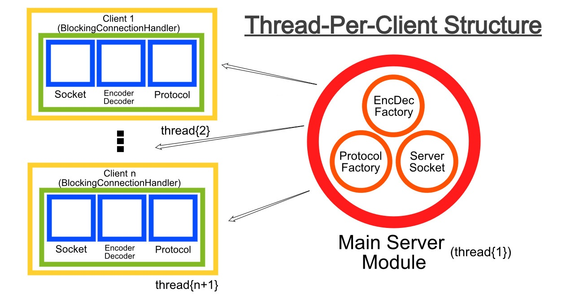
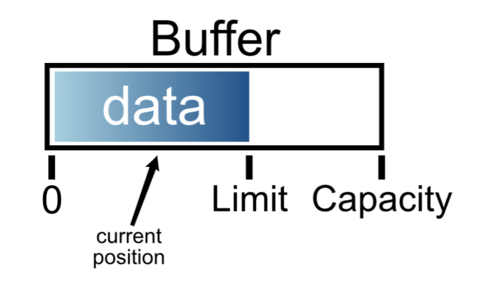

# Practical Session 10 - Thread-Per-Client Server and C++ threads

- [Practical Session 10 - Thread-Per-Client Server and C++ threads](#practical-session-10---thread-per-client-server-and-c-threads)
  - [Threads in C++](#threads-in-c)
    - [Introduction](#introduction)
    - [Creating a Task](#creating-a-task)
    - [Basic Example](#basic-example)
    - [Basic Synchronization](#basic-synchronization)
    - [Self Reading](#self-reading)
  - [Java Thread-Per-Client](#java-thread-per-client)
    - [General diagram](#general-diagram)
    - [Supplier interface](#supplier-interface)
    - [BaseServer Class](#baseserver-class)
    - [BlockingConnectionHandler Class](#blockingconnectionhandler-class)
    - [MessagingProtocol Class](#messagingprotocol-class)
    - [Echo Protocol](#echo-protocol)
    - [MessageEncoderDecoder Class](#messageencoderdecoder-class)
    - [Echo Client](#echo-client)
  - [Java New-IO (nio) classes](#java-new-io-nio-classes)
  - [Non-blocking IO](#non-blocking-io)
    - [Java NIO API](#java-nio-api)
    - [Channels](#channels)
    - [Buffers](#buffers)
    - [Flipping](#flipping)
    - [From Channel to Buffer and back](#from-channel-to-buffer-and-back)

## Threads in C++

### Introduction

The C++ 11 standard library provides several classes that can be used to write multi-threaded programs in C++. The process of writing a multi-threaded program is similar to what you already know from Java (There are few minor differences).

### Creating a Task

You need to perform the following steps:

1. Create a Task class with a run function (or any other name you like). The function can receive arguments. Notice that if you override `operator()` (similar to `operator=` just for ()) then it will be called by default.
1. On the second example, we give the function's address but since it belongs to a class it has a first hidden parameter (the "this" pointer).
1. Create an instance of this class.
1. Create a thread, and start the tasks using the constructor `std::thread t(&MyClass::MyFunction, &instance [, parameter1, parameter2 ...])`.
1. You can use the method `join()` of `std::thread` to wait for single thread.

To complete linking of a code that uses C++ 11 threads you must link the threads library using `-pthread`.

### Basic Example

```cpp
#include <iostream>
#include <thread>

class Task {
private:
    int _id;
public:
    Task (int number) : _id(number) {}

    void operator()(){
        for (int i= 0; i < 100; i++){
           std::cout << i << ") Task " << _id << " is working" << std::endl;
        }
    }
};

int main(){
    Task task1(1);
    Task task2(2);

    std::thread th1(std::ref(task1)); // we use std::ref to avoid creating a copy of the Task object
    std::thread th2(std::ref(task2));
    th1.join();
    th2.join();

    return 0;
}
```

### Basic Synchronization

Basic synchronization is performed using the mutex object `std::mutex`. If several threads share a resource, they should also share a lock. \
When a thread needs to access the shared resources, it should acquire the lock first by creating a `std::lock_guard<std::mutex>` instance (it is not recommended to use mutex directly). \
The constructor acquire the lock on the mutex for the current scope. Upon exiting the scope, the lock is released automatically. This methodology is called [RAII (Resource Acquisition Is Initialization)] (https://en.cppreference.com/w/cpp/language/raii) and it is a common technique we saw also in smart pointers. \

As in Java, only one thread is allowed to acquire the lock in any point in time. Other threads trying to acquire the lock when it is already acquired by some thread, will wait until it is released.

The next example corrects the synchronization problem from the previous example. (The shared resource is the output stream.)

```cpp
#include <iostream>
#include <mutex>
#include <thread>

class Task{
private:
    int _id;
    std::mutex & _mutex;
public:
    Task (int id, std::mutex& mutex) : _id(id), _mutex(mutex) {}

    void run(){
        for (int i= 0; i < 100; i++){
            std::lock_guard<std::mutex> lock(_mutex); // constructor locks the mutex while destructor (out of scope) unlocks it
            std::cout << i << ") Task " << _id << " is working" << std::endl;
        }
    }
};

int main(){
    std::mutex mutex;
    Task task1(1, mutex);
    Task task2(2, mutex);

    std::thread th1(&Task::run, &task1);
    std::thread th2(&Task::run, &task2);
    th1.join();
    th2.join();
    return 0;
}
```

### Self Reading

This was a short introduction to C++ threads. You should read more about it in order to write proper client in C++. \
We recommend the following tutorials:

- [C++11 Multithreading Tutorial](https://thispointer.com/c-11-multithreading-part-1-three-different-ways-to-create-threads/)

## Java Thread-Per-Client

In the previous PS, we reviewed basic Java networking. As you recall reading/writing to network sockets, as well as awaiting new connections on the server side - block thread execution. \
A simple solution to this problem is allocating a thread for each client the server must serve. While the drawback of this method have been discussed in class it's main advantage is that **socket operation can now block threads without interrupting server operation**.

### General diagram

Here is a general diagram describing the server-side code structure:


We will see the code for these components below. We emphasize that all these components and code reside in the server-side!

### Supplier interface

The `Supplier<T>` interface represents "a supplier of results". It provides a single function `get()` function which returns a T object. The Supplier interface is designed by Java, and can be found here.

### BaseServer Class

The `BaseServer` abstract class contains the framework for a Thread-Per-Client server. \
It's `serve()` function constantly attempts to accept new connections. \
Each socket produced by a new connection is handed over to a `BlockingConnectionHandler` along with a `MessagingProtocol` and a `MessageEncoderDecoder`. The newly created `BlockingConnectionHandler` is executed in it's own thread. \
Note the `close()` function required by the Closeable interface - its implementation allows the BaseServer class to be auto-closed in a try-with-resource statement.

```java
public abstract class BaseServer<T> implements Closeable {

    private final int port;
    private final Supplier<MessagingProtocol<T>> protocolFactory;
    private final Supplier<MessageEncoderDecoder<T>> encdecFactory;
    private ServerSocket sock;

    public BaseServer(
            int port,
            Supplier<MessagingProtocol<T>> protocolFactory,
            Supplier<MessageEncoderDecoder<T>> encdecFactory) {

        this.port = port;
        this.protocolFactory = protocolFactory;
        this.encdecFactory = encdecFactory;
        this.sock = null;
    }

    public void serve() {

        try (ServerSocket serverSock = new ServerSocket(port)) {

            this.sock = serverSock; //just to be able to close

            while (!Thread.currentThread().isInterrupted()) {

                Socket clientSock = serverSock.accept();

                BlockingConnectionHandler<T> handler = new BlockingConnectionHandler<>(
                        clientSock,
                        encdecFactory.get(),
                        protocolFactory.get());

                execute(handler);
            }
        } catch (IOException ex) {
        }

        System.out.println("server closed!!!");
    }

    @Override
    public void close() throws IOException {
        if (sock != null)
            sock.close();
    }

    protected abstract void execute(BlockingConnectionHandler<T>  handler);


  //For thread per client implementation:

    public static <T> BaseServer<T> threadPerClient(
            int port,
            Supplier<MessagingProtocol<T>> protocolFactory,
            Supplier<MessageEncoderDecoder<T>> encoderDecoderFactory) {

        return new BaseServer<T>(port, protocolFactory, encoderDecoderFactory) {
            @Override
            protected void execute(BlockingConnectionHandler<T> handler) {
                new Thread(handler).start();
            }
        };

    }
}
```

### BlockingConnectionHandler Class

The `BlockingConnectionHandler` is a runnable whose task is to handle a single connection. \
In order to receive and respond to messages, it uses a `MessageEncoderDecoder` and a `MessagingProtocol`. The first separates incoming bytes into complete messages while the second processes complete messages and produces responses. Responses are then encoded via the `MessageEncoderDecoder` before writing them to the socket.

After the `BlockingConnectionHandler` code we'll present an example of a `MessageEncoderDecoder` and a `MessagingProtocol` for the Echo protocol.

```java
public class BlockingConnectionHandler<T> implements Runnable, Closeable {

    private final MessagingProtocol<T> protocol;
    private final MessageEncoderDecoder<T> encdec;
    private final Socket sock;
    private BufferedInputStream in;
    private BufferedOutputStream out;

    public BlockingConnectionHandler(Socket sock, MessageEncoderDecoder<T> reader, MessagingProtocol<T> protocol) {
        this.sock = sock;
        this.encdec = reader;
        this.protocol = protocol;
    }

    @Override
    public void run() {

        try (Socket sock = this.sock) { //just for automatic closing
            int read;

            in = new BufferedInputStream(sock.getInputStream());
            out = new BufferedOutputStream(sock.getOutputStream());

            while (!protocol.shouldTerminate() && (read = in.read()) >= 0) {
                T nextMessage = encdec.decodeNextByte((byte) read);
                if (nextMessage != null) {
                    T response = protocol.process(nextMessage);
                    if (response != null) {
                        out.write(encdec.encode(response));
                        out.flush();
                    }
                }
            }

        } catch (IOException ex) {
            ex.printStackTrace();
        }

    }

    @Override
    public void close() throws IOException {
        sock.close();
    }
}
```

### MessagingProtocol Class

We define next the protocol interface as we saw in the previous practical session. \
The MessagingProtocol interface operates in the following context: \
A ConnectionHandler instance wraps together:

- The socket connected to the client
- The MessageEncoderDecoder which splits incoming bytes from the socket into messages.

The next step is to pass the incoming messages from the client to the MessagingProtocol which will now execute the action requested by the client. \
The task of the MessagingProtocol is to look at the message and decide what should be done. This decision may depend on the state of the connection (remember the example of the "authenticated" protocol). Once the action is performed, we will need to send an answer to the client. So we expect to get an answer back from the MessagingProtocol.

We model this behavior in the following interface:

```java
public interface MessagingProtocol<T> {

    /**
     * process the given message
     * @param msg the received message
     * @return the response to send or null if no response is expected by the client
     */
    T process(T msg);

    /**
     * @return true if the connection should be terminated
     */
    boolean shouldTerminate();

}
```

Note that we allow the protocol to use message any type of message (the type argument T). This means that the operation of Serialization and Deserialization (encode/decode complex parameters to/from Strings) will be performed by the `MessageEncoderDecoder` - which yield a good separation of concerns.

### Echo Protocol

This interface is now implemented in the form of an "echo protocol" - which will print received messages on the server side screen, then reply with the original message while repeating the last two chars a couple of times. That is, if a client send to the server the line "hello" it will be responded with the line "hello .. lo .. lo .."

```java
public class EchoProtocol implements MessagingProtocol<String> {

    private boolean shouldTerminate = false;

    @Override
    public String process(String msg) {
        shouldTerminate = "bye".equals(msg);
        System.out.println("[" + LocalDateTime.now() + "]: " + msg);
        return createEcho(msg);
    }

    private String createEcho(String message) {
        String echoPart = message.substring(Math.max(message.length() - 2, 0), message.length());
        return message + " .. " + echoPart + " .. " + echoPart + " ..";
    }

    @Override
    public boolean shouldTerminate() {
        return shouldTerminate;
    }
}
```

### MessageEncoderDecoder Class

The MessageEncoderDecoder interface is used to separate incoming bytes from the socket into messages. \

```java
public interface MessageEncoderDecoder<T> {

    /**
     * add the next byte to the decoding process
     *
     * @param nextByte the next byte to consider for the currently decoded
     * message
     * @return a message if this byte completes one or null if it doesnt.
     */
    T decodeNextByte(byte nextByte);

    /**
     * encodes the given message to bytes array
     *
     * @param message the message to encode
     * @return the encoded bytes
     */
    byte[] encode(T message);

}
```

Let's see an example of a MessageEncoderDecoder for the Echo protocol. The MessageEncoderDecoder is responsible for converting between bytes and Strings and for separating incoming bytes into complete messages. \
In our example, we will use the newline character as a separator. This means that the MessageEncoderDecoder will read bytes from the socket until it encounters a newline character. At this point, it will return the message that was read so far.

```java
public class LineMessageEncoderDecoder implements MessageEncoderDecoder<String> {

    private byte[] bytes = new byte[1 << 10]; //start with 1k
    private int len = 0;

    @Override
    public String decodeNextByte(byte nextByte) {
        //notice that the top 128 ascii characters have the same representation as their utf-8 counterparts
        //this allow us to do the following comparison
        if (nextByte == '\n') {
            return popString();
        }

        pushByte(nextByte);
        return null; //not a line yet
    }

    @Override
    public byte[] encode(String message) {
        return (message + "\n").getBytes(); //uses utf8 by default
    }

    private void pushByte(byte nextByte) {
        if (len >= bytes.length) {
            bytes = Arrays.copyOf(bytes, len * 2);
        }

        bytes[len++] = nextByte;
    }

    private String popString() {
        //notice that we explicitly requesting that the string will be decoded from UTF-8
        //this is not actually required as it is the default encoding in java.
        String result = new String(bytes, 0, len, StandardCharsets.UTF_8);
        len = 0;
        return result;
    }
}
```

### Echo Client

Now that we have a full Thread-Per-Client framework, we can test it with a corresponding echo client.

```java
public class EchoClient {

    public static void main(String[] args) throws IOException {

        if (args.length == 0) {
            args = new String[]{"localhost", "7777", "hello"};
        }

        if (args.length < 3) {
            System.out.println("you must supply two arguments: host, port, message");
            System.exit(1);
        }

        //BufferedReader and BufferedWriter automatically using UTF-8 encoding
        try (Socket sock = new Socket(args[0], Integer.valueOf(args[1]));
                BufferedReader in = new BufferedReader(new InputStreamReader(sock.getInputStream()));
                BufferedWriter out = new BufferedWriter(new OutputStreamWriter(sock.getOutputStream()))) {

            System.out.println("sending message to server");
            out.write(args[2] + "\n");
            out.flush();

            System.out.println("awaiting response");
            String line = in.readLine();
            System.out.println("message from server: " + line);
        }
    }
}
```

## Java New-IO (nio) classes

## Non-blocking IO

If we examine our client, once we reach the following code: `String line = in.readLine();` the program is blocked until the user press enter. \
No data can be received through the network buffer. We want a non-blocking i/o handling so that the network buffer will keep working, even when we get to the above code. \
Also, we would like to do so without using more than one thread. \

An example for such program could be a chat application. The client is expected to keep receiving messages, even when the user is typing a new message.

Another example could be a client that need to get updates from several servers: it should try reading from all of them without blocking.

### Java NIO API

Java's `java.nio package` is a new, efficient IO package. It also support Non-blocking IO. \
We will see how to do non-blocking IO in the next practical session. In this session, we will concentrate on some of the concepts of the nio API, and will go over the EchoClient written using the nio API.

The key players we need to know are Channels, Buffers, and Selector. This week we will learn about Channels and Buffers.

### Channels

A Channel is something you can read from and write to. Channels can be either blocking (by default) or non-blocking. We are interested in SocketChannel and ServerSocketChannel.

These are like Socket and ServerSocket we already know, but their read(), write() and accept() methods can be non-blocking.

The ServerSocketChannel's accept() method returns a SocketChannel.

The other side of the connection can of course be either blocking or non-blocking (it doesn't matter).

Setting up a non-blocking ServerSocketChannel listening on a specific port is done as follows:

```java
 int port = 9999;
 ServerSocketChannel ssChannel = ServerSocketChannel.open();
 ssChannel.configureBlocking(false);
 ssChannel.socket().bind(new InetSocketAddress(port));
```

Setting up a non-blocking SocketChannel and connecting to a server is done as follow:

```java
 SocketChannel sChannel=SocketChannel.open();
 sChannel.connect(new InetSocketAddress("localhost", 1234));
 sChannel.configureBlocking(false);
```

### Buffers

All the IO in NIO goes through Buffers.

Channels know how to read and write into Buffers, and buffers can read and write into other buffers.

We'll be using **ByteBuffer**. These are buffers that hold bytes.

Creating a new ByteBuffer:

```java
final int NUM_OF_BYTES = 1024;
ByteBuffer buf = ByteBuffer.allocate(NUM_OF_BYTES);
```

Creating a ByteBuffer from an array of bytes:

```java
 byte[] bytes = new byte[10];
 ByteBuffer buf = ByteBuffer.wrap(bytes);
```

### Flipping

Each buffer has a **capacity**, **limit** and a **position marker**. The capacity is the total amount of data that can reside in the buffer at a time (think of it as size). The limit is how much data actually exists inside the buffer. The position is like a read/write head pointing to the position that the read has reached or the write has filled.
You can't read or write more than the limit of the buffer. You can't increase the limit over the capacity. It can be described as

```java
0 <= position <= limit <= capacity
```

Here is a diagram of the structure:



A read operation reads a specified number of bytes from the current position, and updates the position marker to point to the yet unread bytes. Similarly, a write operation writes some bytes from the current position, and then advances the position.

This means that if someone wrote some bytes into a buffer, and then you want to read them, you need to set the position marker to the start of the buffer, and the limit of the buffer to the former position.

This is what the Buffer's `flip()` method does. It sets the limit of the buffer to the current position marker, and the position marker to the start of the Buffer.

It is equivalent to:

```java
Buffer b = ...;
int position = b.position();
b.limit(position);
b.position(0);
```

In short, always make sure to call the flip method if you want to read from the buffer after someone has written to it.

### From Channel to Buffer and back

Reading from a channel to a buffer:

```java
numBytesRead = _socketChannel.read(buf);
```

Writing from a buffer to a channel:

```java
numBytesWritten = _socketChannel.write(buf);
```

If read or write returns -1, it means that the channel is closed.

Read and write operations on Buffers update the position marker accordingly.
